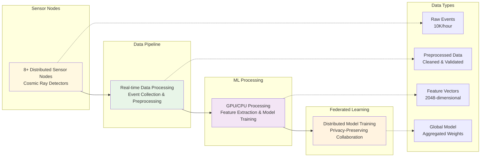
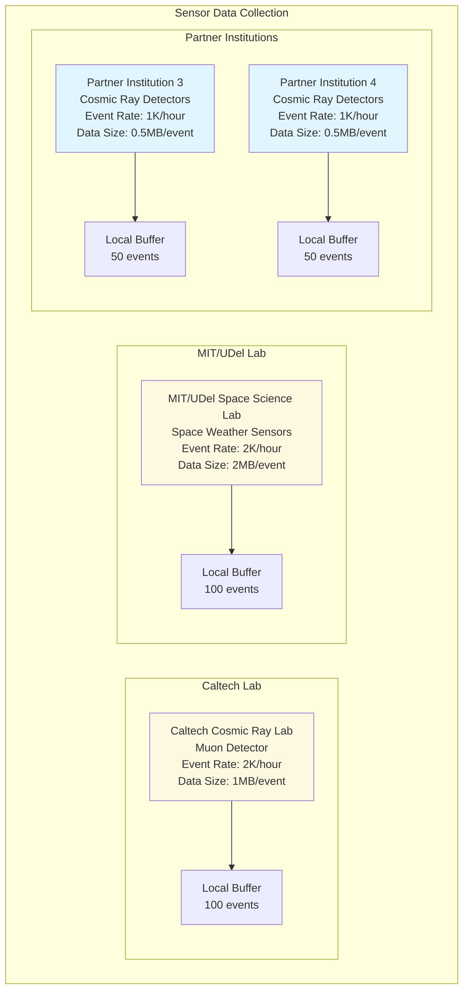
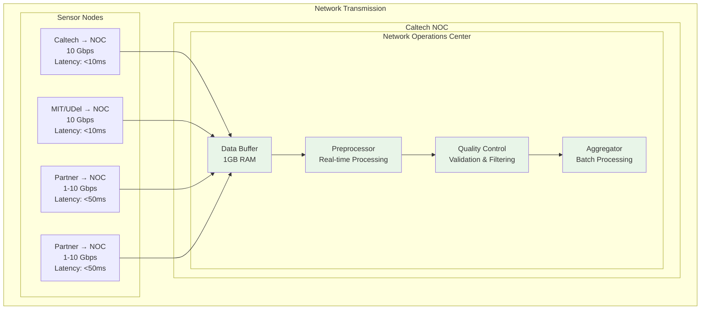
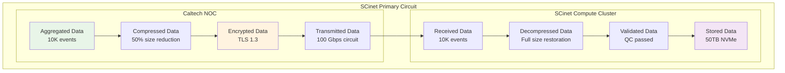
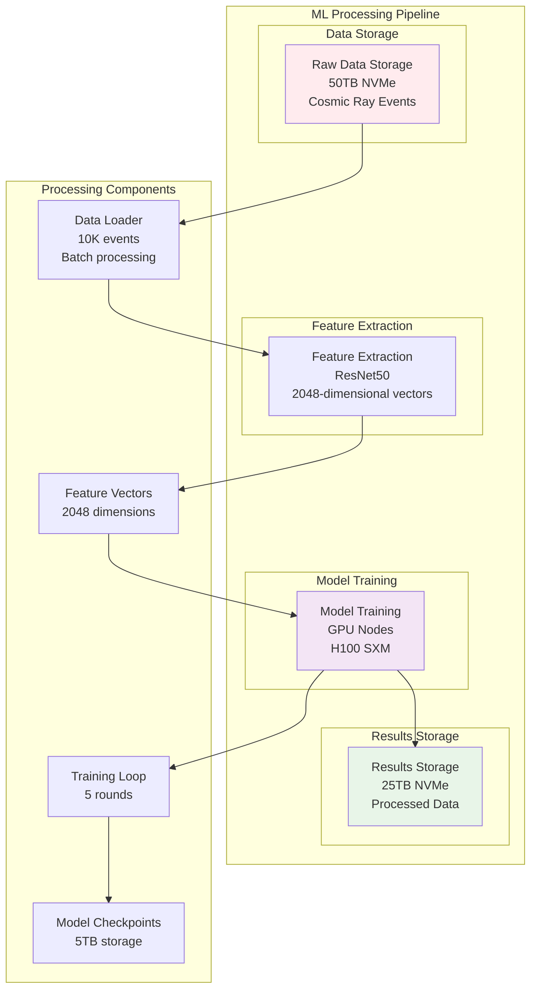
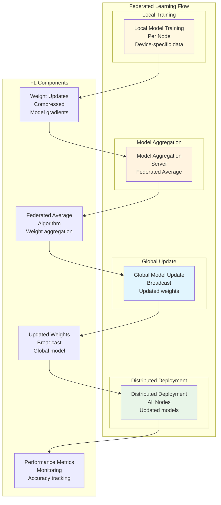

# CREDO Data Flow Diagram

## Overall Data Flow Architecture



## Detailed Data Flow

### Phase 1: Data Collection



### Phase 2: Data Transmission



### Phase 3: SCinet Transmission



### Phase 4: Machine Learning Processing



### Phase 5: Federated Learning



## Data Volume Analysis

### Real-time Data Flow
```
Hourly Data Volume:
├── Caltech Lab: 2,000 events × 1MB = 2GB/hour
├── MIT/UDel Lab: 2,000 events × 2MB = 4GB/hour
├── Partner Institutions: 6,000 events × 0.5MB = 3GB/hour
└── Total: 10,000 events = 9GB/hour = 216GB/day
```

### Network Bandwidth Requirements
```
Peak Bandwidth Usage:
├── Real-time Events: 20 Gbps (continuous)
├── Federated Learning: 60 Gbps (burst during rounds)
├── Model Updates: 40 Gbps (burst during aggregation)
├── Control Traffic: 10 Gbps (continuous)
└── Total Peak: 160 Gbps
```

### Storage Requirements
```
Data Storage Breakdown:
├── Raw Data: 50TB (cosmic ray events)
├── Processed Data: 25TB (feature vectors)
├── Model Storage: 5TB (federated learning models)
├── Temporary Storage: 20TB (intermediate processing)
└── Total: 100TB NVMe storage
```

## Processing Latency

### End-to-End Latency Targets
```
Real-time Processing:
├── Sensor → Local Buffer: < 1ms
├── Local Buffer → NOC: < 10ms
├── NOC → SCinet: < 50ms
├── SCinet → Processing: < 100ms
├── Processing → Results: < 500ms
└── Total End-to-End: < 661ms
```

### Federated Learning Latency
```
Model Training Cycle:
├── Local Training: 30-60 seconds
├── Weight Upload: < 100ms
├── Global Aggregation: < 50ms
├── Model Broadcast: < 100ms
└── Total Round: 31-61 seconds
```

## Data Security & Integrity

### Encryption & Authentication
```
Security Measures:
├── Data in Transit: TLS 1.3 encryption
├── Data at Rest: AES-256 encryption
├── Authentication: X.509 certificates
├── Authorization: Role-based access control
└── Integrity: SHA-256 checksums
```

### Quality Control
```
Data Validation:
├── Format Validation: JSON schema compliance
├── Content Validation: Cosmic ray event structure
├── Timestamp Validation: Event timing accuracy
├── Source Validation: Sensor authentication
└── Quality Score: > 95% valid events
```

## Performance Monitoring

### Real-time Metrics
```
Monitoring Points:
├── Network Latency: < 10ms (sensor to NOC)
├── Data Throughput: 50 Gbps sustained
├── Processing Speed: 10K events/hour
├── Model Accuracy: > 95% classification
└── System Uptime: 99.9% availability
```

### Alerting Thresholds
```
Alert Conditions:
├── Latency > 100ms: Warning
├── Latency > 500ms: Critical
├── Throughput < 80%: Warning
├── Throughput < 50%: Critical
├── Error Rate > 1%: Warning
└── Error Rate > 5%: Critical
```

---

**Document Version**: 1.0  
**Last Updated**: August 1, 2025  
**Status**: Ready for SCinet Review 