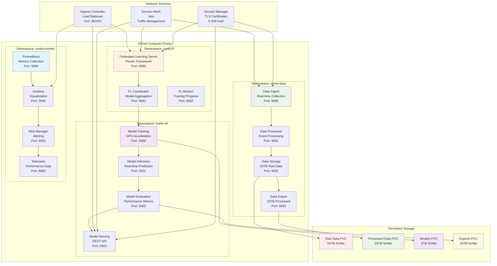
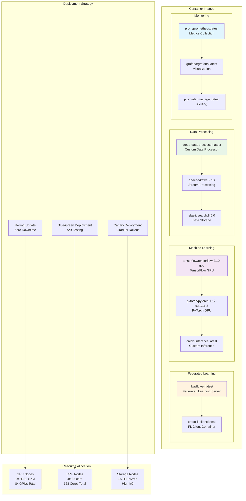
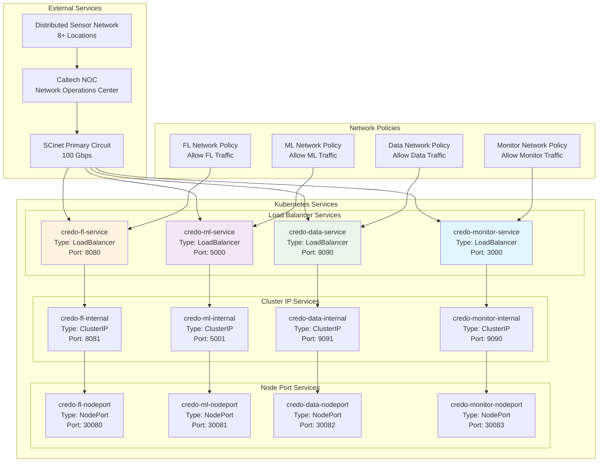
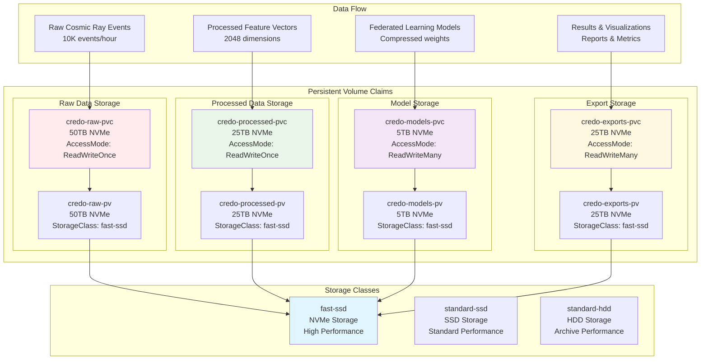
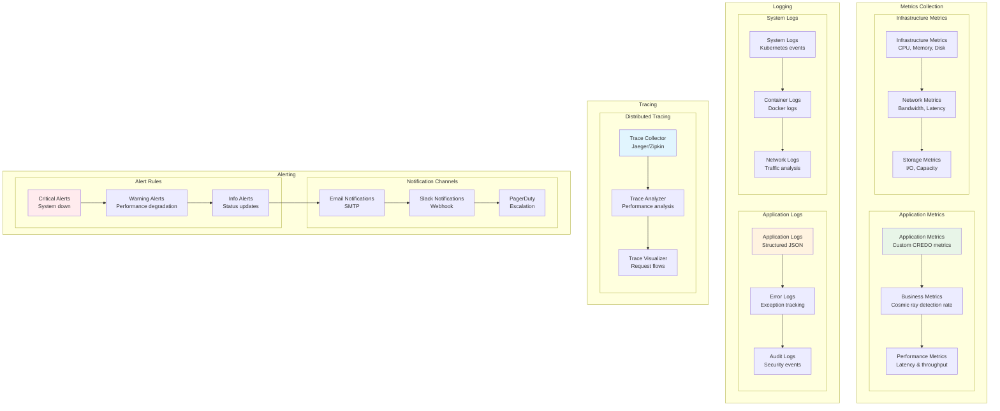

# CREDO Deployment Architecture

## System Overview

This document describes the detailed deployment architecture for the CREDO cosmic ray detection experiment at SC25 NRE, including the Kubernetes deployment, federated learning setup, and data processing pipeline.

## Kubernetes Deployment Architecture



## Container Architecture



## Service Architecture



## Storage Architecture



## Security Architecture

```mermaid
graph TB
    subgraph "Authentication & Authorization"
        subgraph "Identity Management"
            SERVICE_ACCOUNTS[Kubernetes Service Accounts<br/>Namespace-specific]
            RBAC[Role-Based Access Control<br/>Fine-grained permissions]
            SECRETS[Kubernetes Secrets<br/>TLS certificates]
        end
        
        subgraph "Network Security"
            NETWORK_POLICIES[Network Policies<br/>Pod-to-pod communication]
            INGRESS_RULES[Ingress Rules<br/>External access control]
            EGRESS_RULES[Egress Rules<br/>Outbound traffic control]
        end
        
        subgraph "Data Security"
            ENCRYPTION[Data Encryption<br/>TLS 1.3 in transit<br/>AES-256 at rest]
            INTEGRITY[Data Integrity<br/>SHA-256 checksums]
            AUDIT[Audit Logging<br/>All access attempts]
        end
    end
    
    subgraph "Security Components"
        subgraph "TLS/SSL"
            TLS_CERTS[TLS Certificates<br/>X.509 certificates]
            CERT_MANAGER[Cert Manager<br/>Automatic certificate renewal]
        end
        
        subgraph "Secrets Management"
            SECRETS_STORE[Secrets Store<br/>Encrypted secrets]
            VAULT[Hashicorp Vault<br/>Centralized secrets]
        end
        
        subgraph "Monitoring"
            SECURITY_MONITOR[Security Monitoring<br/>Intrusion detection]
            COMPLIANCE[Compliance Checking<br/>Policy enforcement]
        end
    end
    
    SERVICE_ACCOUNTS --> RBAC
    RBAC --> SECRETS
    SECRETS --> NETWORK_POLICIES
    NETWORK_POLICIES --> INGRESS_RULES
    INGRESS_RULES --> EGRESS_RULES
    EGRESS_RULES --> ENCRYPTION
    ENCRYPTION --> INTEGRITY
    INTEGRITY --> AUDIT
    
    TLS_CERTS --> CERT_MANAGER
    CERT_MANAGER --> SECRETS_STORE
    SECRETS_STORE --> VAULT
    VAULT --> SECURITY_MONITOR
    SECURITY_MONITOR --> COMPLIANCE
    
    style SERVICE_ACCOUNTS fill:#e8f5e8
    style ENCRYPTION fill:#fff3e0
    style SECURITY_MONITOR fill:#e1f5fe
```



## Monitoring & Observability



## Deployment Configuration

### Kubernetes Manifests

```yaml
# Federated Learning Deployment
apiVersion: apps/v1
kind: Deployment
metadata:
  name: credo-fl-server
  namespace: credo-fl
spec:
  replicas: 1
  selector:
    matchLabels:
      app: credo-fl-server
  template:
    metadata:
      labels:
        app: credo-fl-server
    spec:
      containers:
      - name: fl-server
        image: flwr/flower:latest
        ports:
        - containerPort: 8080
        resources:
          requests:
            cpu: "2"
            memory: "4Gi"
          limits:
            cpu: "4"
            memory: "8Gi"
        env:
        - name: FL_SERVER_PORT
          value: "8080"
        - name: FL_SERVER_ADDRESS
          value: "0.0.0.0"
        volumeMounts:
        - name: fl-models
          mountPath: /models
      volumes:
      - name: fl-models
        persistentVolumeClaim:
          claimName: credo-models-pvc
---
# Machine Learning Deployment
apiVersion: apps/v1
kind: Deployment
metadata:
  name: credo-ml-training
  namespace: credo-ml
spec:
  replicas: 2
  selector:
    matchLabels:
      app: credo-ml-training
  template:
    metadata:
      labels:
        app: credo-ml-training
    spec:
      containers:
      - name: ml-training
        image: tensorflow/tensorflow:2.10-gpu
        ports:
        - containerPort: 5000
        resources:
          requests:
            nvidia.com/gpu: 1
            cpu: "4"
            memory: "8Gi"
          limits:
            nvidia.com/gpu: 1
            cpu: "8"
            memory: "16Gi"
        volumeMounts:
        - name: ml-data
          mountPath: /data
        - name: ml-models
          mountPath: /models
      volumes:
      - name: ml-data
        persistentVolumeClaim:
          claimName: credo-processed-pvc
      - name: ml-models
        persistentVolumeClaim:
          claimName: credo-models-pvc
```

### Service Configuration

```yaml
# Federated Learning Service
apiVersion: v1
kind: Service
metadata:
  name: credo-fl-service
  namespace: credo-fl
spec:
  selector:
    app: credo-fl-server
  ports:
  - name: http
    port: 8080
    targetPort: 8080
  type: LoadBalancer
---
# Machine Learning Service
apiVersion: v1
kind: Service
metadata:
  name: credo-ml-service
  namespace: credo-ml
spec:
  selector:
    app: credo-ml-training
  ports:
  - name: http
    port: 5000
    targetPort: 5000
  type: LoadBalancer
```

### Storage Configuration

```yaml
# Raw Data PVC
apiVersion: v1
kind: PersistentVolumeClaim
metadata:
  name: credo-raw-pvc
  namespace: credo-data
spec:
  accessModes:
    - ReadWriteOnce
  resources:
    requests:
      storage: 50Ti
  storageClassName: fast-ssd
---
# Processed Data PVC
apiVersion: v1
kind: PersistentVolumeClaim
metadata:
  name: credo-processed-pvc
  namespace: credo-data
spec:
  accessModes:
    - ReadWriteOnce
  resources:
    requests:
      storage: 25Ti
  storageClassName: fast-ssd
---
# Models PVC
apiVersion: v1
kind: PersistentVolumeClaim
metadata:
  name: credo-models-pvc
  namespace: credo-ml
spec:
  accessModes:
    - ReadWriteMany
  resources:
    requests:
      storage: 5Ti
  storageClassName: fast-ssd
---
# Exports PVC
apiVersion: v1
kind: PersistentVolumeClaim
metadata:
  name: credo-exports-pvc
  namespace: credo-ml
spec:
  accessModes:
    - ReadWriteMany
  resources:
    requests:
      storage: 25Ti
  storageClassName: fast-ssd
```

---

**Document Version**: 1.0  
**Last Updated**: August 1, 2025  
**Status**: Ready for SCinet Review 