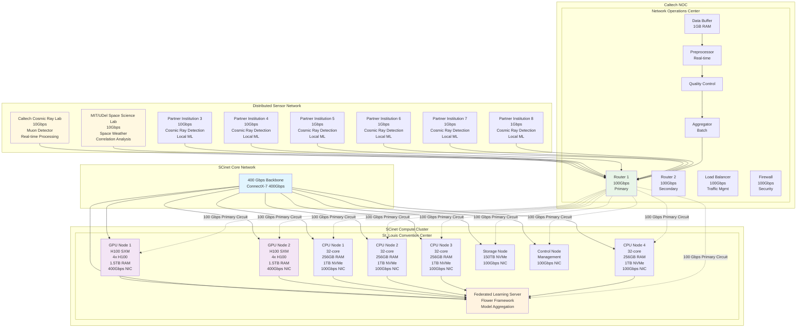
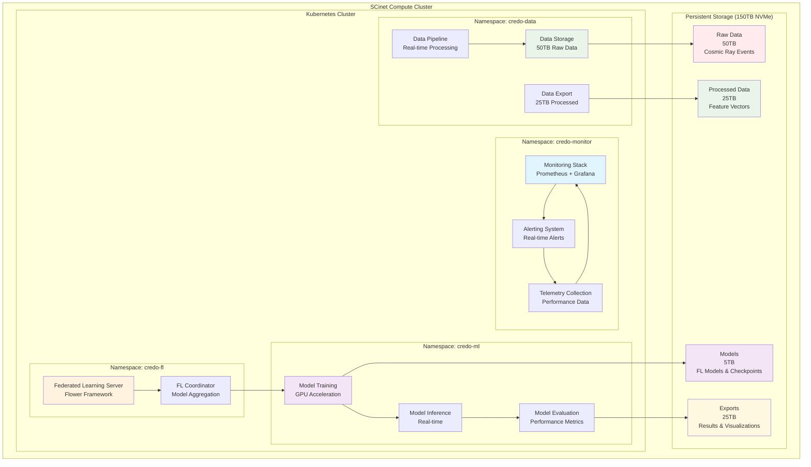

# CREDO Network Topology Diagram

## Overall Architecture



## Bandwidth Allocation

### Primary Circuit (SCinet Managed)
- **Total Bandwidth**: 100 Gbps
- **Real-time Data**: 20 Gbps (20%)
- **Federated Learning**: 60 Gbps (60%)
- **Control Traffic**: 10 Gbps (10%)
- **Monitoring**: 10 Gbps (10%)

### Secondary Circuits (Self-Managed)
- **Caltech Lab**: 10 Gbps
- **MIT/University of Delaware Lab**: 10 Gbps
- **Partner Institutions**: 40 Gbps total (5-10 Gbps each)

### Peak Usage Scenarios
- **Normal Operation**: 50 Gbps sustained
- **Federated Learning Round**: 160 Gbps burst
- **Data Synchronization**: 80 Gbps burst
- **Emergency Mode**: 200 Gbps peak

## Network Protocols

### Layer 2/3 Configuration
```
Primary Circuit:
- Protocol: IPv6
- VLAN: 1001 (Federated Learning)
- QoS: Priority queuing
- Encryption: TLS 1.3

Secondary Circuits:
- Protocol: IPv6
- VLAN: 1002 (Sensor Data)
- QoS: Best effort
- Encryption: TLS 1.3
```

### Application Protocols
```
Federated Learning: TCP/8888 (Flower)
Data Streaming: WebSocket/TLS (Port 443)
Model Transfer: HTTP/2/TLS (Port 443)
Monitoring: HTTP (Port 9090)
Control: gRPC (Port 50051)
```

## Performance Metrics

### Latency Targets
- **Real-time Events**: < 10ms
- **Model Updates**: < 100ms
- **Data Sync**: < 1s
- **Control Commands**: < 50ms

### Throughput Targets
- **Peak Data Rate**: 160 Gbps
- **Sustained Rate**: 50 Gbps
- **Storage I/O**: 100 Gbps
- **Inter-node**: 400 Gbps

### Reliability Targets
- **Uptime**: 99.9%
- **Packet Loss**: < 0.01%
- **Failover Time**: < 30s
- **Data Integrity**: 100%

## Deployment Architecture

### Compute Cluster Layout



---

**Document Version**: 1.0  
**Last Updated**: August 1, 2025  
**Status**: Ready for SCinet Review 