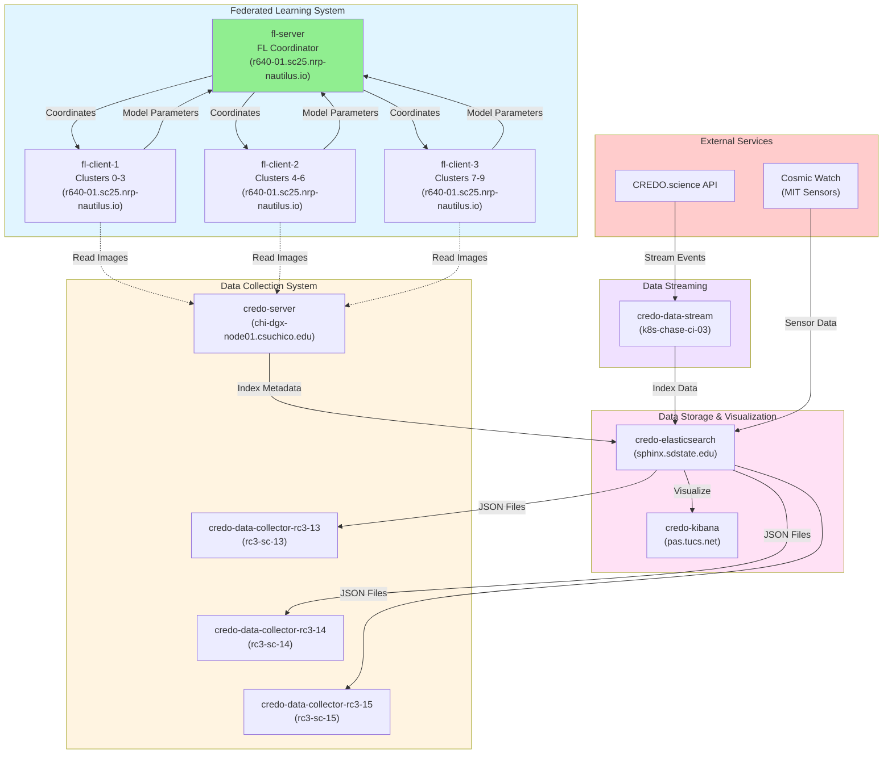
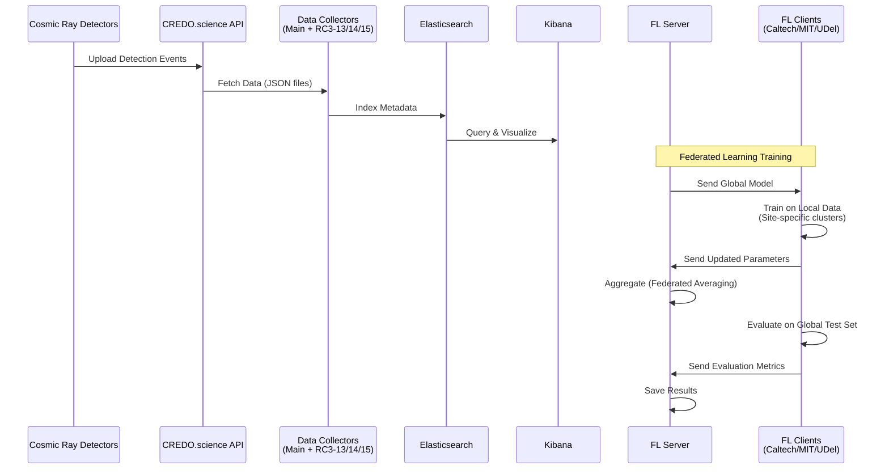

# CREDO Pod Architecture and Responsibilities

This document explains what each pod in the CREDO federated learning system does, their locations, and how they interact.

## System Architecture Diagram



## Presentation Description (1-minute read)

This diagram demonstrates the CREDO federated learning system deployed across SC25 NRP nodes, showcasing how **minimal data transmission enables distributed machine learning at scale**.

While SC25 emphasizes high-bandwidth network demonstrations, this system intentionally transmits very little data during federated learning—and that's the point. The **Federated Learning System** on `r640-01.sc25.nrp-nautilus.io` exchanges only compact model parameters instead of transferring the full cosmic ray image dataset. In our analysis, we observed approximately **98.8% bandwidth reduction** compared to traditional centralized approaches that would require moving entire image datasets. This minimal transmission enables collaborative training across three institutions (Caltech, MIT, and UDel) without saturating network capacity. The bandwidth benefits **improve with scale**—since model parameter size remains constant while raw data scales linearly with dataset size, we expect bandwidth savings to increase from 98.8% to over 99% as collections expand, and we plan to explore this scaling behavior in future work.

However, the network infrastructure is still actively exercised through other components. The **Data Collection System** uses three dedicated SC25 nodes—rc3-sc-13, rc3-sc-14, and rc3-sc-15—to demonstrate SC25 network links by transferring CREDO JSON files between pods, showcasing bandwidth utilization across multiple network paths. These pods can also fetch data in parallel from the CREDO.science API when data collection is active. **Real-time streaming services** continuously ingest detection events, and all metadata flows through **Elasticsearch** for distributed indexing and querying.

The solid arrows show lightweight parameter exchanges that enable global model training, while the dotted lines indicate local data access—demonstrating that federated learning achieves distributed machine learning by minimizing network transmission, not maximizing it. This architecture proves that efficient network usage can enable collaborative scientific computing without saturating bandwidth.

## Pod Details

### 🔄 Federated Learning Pods

#### 1. `caltech-fl-server-67dd85b95d-fl2dn`
- **Role**: Federated Learning Coordinator
- **Location**: `r640-01.sc25.nrp-nautilus.io`
- **Purpose**: Coordinates federated learning training across all three sites
- **Responsibilities**:
  - Aggregates model parameters from all clients using Federated Averaging
  - Distributes the global model to all clients
  - Tracks training progress across 5 rounds
  - Saves final training results to `/workspace/fl-server/fl_training_results.json`
  - Saves per-site test accuracy to `/workspace/fl-server/fl_test_accuracy_per_site.json`
- **Port**: 5000 (gRPC for FL communication)
- **Status**: Running (PID 91)

#### 2. `caltech-fl-client-55d9b694c6-hbt54`
- **Role**: Caltech Federated Learning Client
- **Location**: `r640-01.sc25.nrp-nautilus.io`
- **Purpose**: Trains on Caltech's assigned data (clusters 0-3)
- **Responsibilities**:
  - Receives global model parameters from FL server
  - Trains locally on Caltech's cosmic ray images (clusters 0-3 only)
  - Evaluates on global test set (all 10 classes: 0-9)
  - Calculates per-class accuracy for all 10 classes
  - Sends updated model parameters back to server
- **Data**: Only sees clusters 0-3 during training, but tests on all clusters
- **Status**: Running

#### 3. `mit-fl-client-564746cc7d-7nqw5`
- **Role**: MIT Federated Learning Client
- **Location**: `r640-01.sc25.nrp-nautilus.io`
- **Purpose**: Trains on MIT's assigned data (clusters 4-6)
- **Responsibilities**:
  - Same as Caltech client but uses MIT's data (clusters 4-6)
  - Participates in federated learning rounds
  - Evaluates on global test set (all 10 classes)
- **Data**: Only sees clusters 4-6 during training, but tests on all clusters
- **Status**: Running

#### 4. `udel-fl-client-7f4cdc466b-9nnkl`
- **Role**: University of Delaware Federated Learning Client
- **Location**: `r640-01.sc25.nrp-nautilus.io`
- **Purpose**: Trains on UDel's assigned data (clusters 7-9)
- **Responsibilities**:
  - Same as other clients but uses UDel's data (clusters 7-9)
  - Participates in federated learning rounds
  - Evaluates on global test set (all 10 classes)
- **Data**: Only sees clusters 7-9 during training, but tests on all clusters
- **Status**: Running

### 📥 Data Collection & Processing Pods

#### 5. `credo-caltech-server-6556dd587d-cw7k6`
- **Role**: Main CREDO Data Fetcher & Staging Server
- **Location**: `chi-dgx-node01.csuchico.edu`
- **Purpose**: Fetches cosmic ray data from CREDO.science API and stages it for Elasticsearch
- **Responsibilities**:
  - Runs `credo-data-exporter.py` to download detection data from CREDO.science API
  - **Temporarily stores** JSON files at `/tmp/credo-data-temp/` (staging area)
  - **Copies data directly to Elasticsearch pod** (data doesn't persist on this server)
  - Provides GPU resources (nvidia.com/gpu: 1) for potential image processing
  - Hosts Jupyter notebook server (port 8888) for data analysis
  - Provides API server (port 5000) and web interface (port 8080)
  - **Data Flow**: CREDO API → CSU Chico Server (temporary) → Elasticsearch (permanent)
- **Resources**: 4-8 CPU cores, 16-32 Gi memory, 1 GPU
- **Note**: This server acts as a **data fetcher and staging area**, not permanent storage. All data is ultimately copied to Elasticsearch.
- **Status**: Running (26h uptime)

#### 6. `credo-data-collector-rc3-13-687d7f48bc-zpjm4`
- **Role**: RC3-SC-13 Data Collector & Network Demonstration
- **Location**: `rc3-sc-13.sc25.nrp-nautilus.io`
- **Purpose**: Collects cosmic ray data and demonstrates SC25 network links
- **Responsibilities**:
  - Independently fetches data from CREDO.science API (when data collection is active)
  - Tracks what it has already collected (using `last_exported_detection`)
  - Collects **new, unique data** that hasn't been collected yet
  - Stores data in `/workspace/credo-data-rc3/detections/*.json` inside the pod
  - **Network Demonstration**: Transfers CREDO JSON files to other RC3 pods to showcase SC25 network bandwidth
- **Node Affinity**: Pinned to `rc3-sc-13.sc25.nrp-nautilus.io`
- **Network Demo**: Use `./deploy/demo-rc3-network.sh demo` to demonstrate network links
- **Status**: Running (24h uptime)

#### 7. `credo-data-collector-rc3-14-5d4cbd54c8-hftvz`
- **Role**: RC3-SC-14 Data Collector & Network Demonstration
- **Location**: `rc3-sc-14.sc25.nrp-nautilus.io`
- **Purpose**: Collects cosmic ray data and demonstrates SC25 network links
- **Responsibilities**: Same as RC3-13 collector
- **Node Affinity**: Pinned to `rc3-sc-14.sc25.nrp-nautilus.io`
- **Network Demo**: Participates in ring topology transfers (13→14→15→13) to demonstrate SC25 network links
- **Status**: Running (24h uptime)

#### 8. `credo-data-collector-rc3-15-86f6449dfc-5vwtz`
- **Role**: RC3-SC-15 Data Collector & Network Demonstration
- **Location**: `rc3-sc-15.sc25.nrp-nautilus.io`
- **Purpose**: Collects cosmic ray data and demonstrates SC25 network links
- **Responsibilities**: Same as other RC3 collectors
- **Node Affinity**: Pinned to `rc3-sc-15.sc25.nrp-nautilus.io`
- **Network Demo**: Participates in ring topology transfers (13→14→15→13) to demonstrate SC25 network links
- **Status**: Running (24h uptime)

### 📊 Data Storage & Visualization Pods

#### 9. `credo-elasticsearch-es-default-0`
- **Role**: Elasticsearch Database
- **Location**: `sphinx.sdstate.edu`
- **Purpose**: Stores and indexes cosmic ray detection metadata
- **Responsibilities**:
  - Indexes detection data for search/query operations
  - Provides searchable database of cosmic ray events
  - Stores metadata (timestamps, device IDs, locations, altitudes, particle types, etc.)
  - Index name: `credo-detections`
  - **Receives data from multiple sources**:
    - CREDO server and RC3 collectors (via data export)
    - credo-stream and credo-data-stream (real-time streaming)
    - Cosmic Watch sensors (external MIT detectors)
- **Port**: 9200 (HTTP), 9300 (Transport)
- **Status**: Running (55 days uptime - very stable!)

#### 10. `credo-kibana-kb-649546c49d-sqq4p`
- **Role**: Kibana Visualization Dashboard
- **Location**: `pas.tucs.net.internet2.edu`
- **Purpose**: Provides web UI for visualizing Elasticsearch data
- **Responsibilities**:
  - Web interface for querying cosmic ray data
  - Data visualization and analytics dashboards
  - Monitoring and exploration of detections
  - Real-time data visualization
- **Status**: Running (2 days 3 hours uptime)

### 🌊 Data Streaming Pods

#### 11. `credo-data-stream-29392880-jht2z`
- **Role**: Data Streaming Service
- **Location**: `k8s-chase-ci-03.calit2.optiputer.net`
- **Purpose**: Streams cosmic ray detection data in real-time
- **Responsibilities**:
  - Streams detection events from CREDO.science API
  - Processes incoming data streams in real-time
  - Handles continuous data ingestion
  - **Indexes streamed data to Elasticsearch**
- **Status**: Running (106 minutes uptime, 4 restarts - may indicate connection issues)

#### 12. `credo-stream-79f8958f96-z7j9b`
- **Role**: General Streaming Service
- **Location**: `pas.tucs.net.internet2.edu`
- **Purpose**: Additional data streaming/processing
- **Responsibilities**:
  - Handles data streaming operations
  - **Indexes streamed data to Elasticsearch**
- **Status**: Running (3 days 2 hours uptime)

## Data Flow Summary



## Key Architecture Points

### 🎯 Pod Grouping by Function

1. **Federated Learning Pods** (4 pods on `r640-01`)
   - All FL pods are on the same node for low-latency communication
   - Enables fast parameter exchange during training rounds
   - Reduces network overhead in federated learning protocol

2. **Data Collection Pods** (4 pods across different nodes)
   - Main collector on `chi-dgx-node01` (GPU-enabled)
   - Three RC3 collectors on dedicated SC25 nodes (rc3-sc-13, rc3-sc-14, rc3-sc-15)
   - Distributed collection for parallel data fetching
   - **Network Demonstration**: RC3 pods transfer CREDO JSON files between each other to showcase SC25 network bandwidth utilization

3. **Storage & Visualization** (2 pods on different nodes)
   - Elasticsearch for metadata storage
   - Kibana for data exploration

4. **Streaming Services** (2 pods)
   - Real-time data ingestion
   - Continuous processing

### 🔒 Privacy & Security

- **Federated Learning**: Clients only share model parameters, never raw data
- **Data Isolation**: Each site only trains on their assigned clusters
- **Global Testing**: All sites evaluate on the same global test set (all 10 classes)

### 📈 Training Process

1. **Round 1-5**: Each round consists of:
   - Server sends global model to all clients
   - Clients train locally on their data (site-specific clusters)
   - Clients send updated parameters to server
   - Server aggregates parameters (Federated Averaging)
   - Clients evaluate on global test set (all 10 classes)
   - Server collects evaluation metrics

2. **Final Result**: Global model that can classify all 10 cosmic ray pattern classes, even though each site only trained on 3-4 classes

### 🌐 SC25 Network Demonstration

The three RC3-SC pods (rc3-sc-13, rc3-sc-14, rc3-sc-15) are used to demonstrate SC25 network links by transferring CREDO JSON files between pods:

- **Ring Topology Transfer**: Data flows in a ring pattern (13→14→15→13) to showcase network connectivity
- **Real CREDO Data**: Uses actual CREDO JSON detection files (no synthetic data)
- **Bandwidth Measurement**: Tracks transfer times and throughput to demonstrate network performance
- **SC25 Infrastructure**: Exercises the SC25 network infrastructure across multiple nodes

**To run network demonstration:**
```bash
# Ensure RC3 pods have CREDO JSON files (from data collection or Elasticsearch)
./deploy/demo-rc3-network.sh demo
```

This demonstrates that while federated learning minimizes data transmission, the SC25 network infrastructure is still actively utilized for data collection and distribution across the three RC3 nodes.

## Monitoring Commands

```bash
# Check all pods and their nodes
kubectl get pods -n cblee-credo -o wide

# Check FL server logs
kubectl logs -n cblee-credo -l app=caltech-fl-server -f

# Check FL client logs
kubectl logs -n cblee-credo -l app=caltech-fl-client -f
kubectl logs -n cblee-credo -l app=mit-fl-client -f
kubectl logs -n cblee-credo -l app=udel-fl-client -f

# Check data collector status
kubectl logs -n cblee-credo -l app=credo-data-collector-rc3-13 -f

# Demonstrate SC25 network links using RC3 pods
./deploy/demo-rc3-network.sh demo

# Check Elasticsearch
kubectl port-forward -n cblee-credo svc/credo-elasticsearch-service 9200:9200

# Check Kibana
kubectl port-forward -n cblee-credo svc/credo-kibana-kb 5601:5601
```

## Summary Table

| Pod Name | Role | Location | Status | Uptime |
|----------|------|----------|--------|--------|
| caltech-fl-server | FL Coordinator | r640-01 | Running | 14h |
| caltech-fl-client | FL Client (0-3) | r640-01 | Running | 14h |
| mit-fl-client | FL Client (4-6) | r640-01 | Running | 14h |
| udel-fl-client | FL Client (7-9) | r640-01 | Running | 14h |
| credo-caltech-server | Data Fetcher | chi-dgx-node01 | Running | 26h |
| credo-data-collector-rc3-13 | Data Collector | rc3-sc-13 | Running | 24h |
| credo-data-collector-rc3-14 | Data Collector | rc3-sc-14 | Running | 24h |
| credo-data-collector-rc3-15 | Data Collector | rc3-sc-15 | Running | 24h |
| credo-elasticsearch | Database | sphinx.sdstate.edu | Running | 55d |
| credo-kibana | Dashboard | pas.tucs.net | Running | 2d3h |
| credo-data-stream | Stream Service | k8s-chase-ci-03 | Running | 106m |
| credo-stream | Stream Service | pas.tucs.net | Running | 3d2h |

