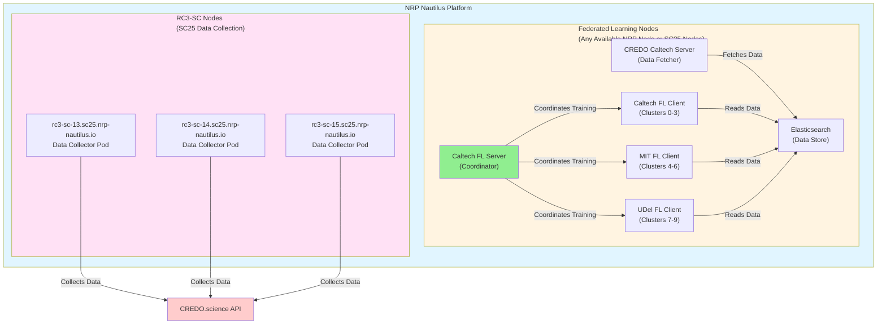
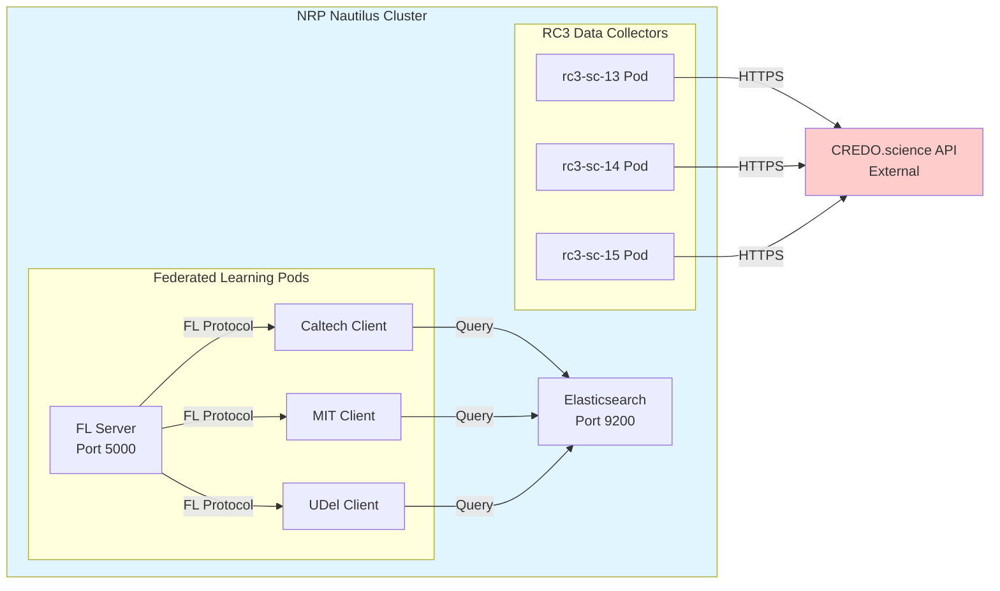

# NRP Nodes Used for CREDO Project

This document shows which NRP (National Research Platform) Nautilus nodes are being used for the CREDO federated learning and data collection system.

## Node Usage Overview



## Detailed Node Information

### Federated Learning System Nodes

**Namespace**: `cblee-credo`

**Pods** (can run on any available NRP node or optionally on SC25 nodes):
- **Caltech FL Server**: Federated learning coordinator
- **Caltech FL Client**: Handles clusters 0-3
- **MIT FL Client**: Handles clusters 4-6
- **UDel FL Client**: Handles clusters 7-9
- **CREDO Caltech Server**: Data fetcher from CREDO.science API
- **Elasticsearch**: Data storage and indexing

**Resource Requirements**:
- CPU: 4-8 cores per pod
- Memory: 16-32 Gi per pod
- GPU: Optional (nvidia.com/gpu: 1) or QAIC (qualcomm.com/qaic: 1)

**Node Selection**:
- Currently uses Kubernetes automatic scheduling (any available node)
- Can optionally be pinned to SC25 nodes using `SC25_NODE_NAME` environment variable
- Uses toleration: `nautilus.io/reservation=scinet` when pinned to SC25 nodes

### RC3-SC Data Collection Nodes

**Specific Nodes Used**:
1. **rc3-sc-13.sc25.nrp-nautilus.io**
   - Pod: `credo-data-collector-rc3-13`
   - Purpose: Parallel data collection from CREDO.science API

2. **rc3-sc-14.sc25.nrp-nautilus.io**
   - Pod: `credo-data-collector-rc3-14`
   - Purpose: Parallel data collection from CREDO.science API

3. **rc3-sc-15.sc25.nrp-nautilus.io**
   - Pod: `credo-data-collector-rc3-15`
   - Purpose: Parallel data collection from CREDO.science API

**Node Affinity**: These pods are **pinned** to specific nodes using:
```yaml
nodeAffinity:
  requiredDuringSchedulingIgnoredDuringExecution:
    nodeSelectorTerms:
    - matchExpressions:
      - key: kubernetes.io/hostname
        operator: In
        values:
        - rc3-sc-{13,14,15}.sc25.nrp-nautilus.io
```

**Toleration**: `nautilus.io/reservation=scinet`

**Resource Requirements**:
- CPU: 2-4 cores per pod
- Memory: 8-16 Gi per pod

## Container Image

All pods use:
```
gitlab-registry.nrp-nautilus.io/cloud-ai-100/qaic-docker-images:vllm-latest
```

## Network Architecture



## Summary

- **Total NRP Nodes Used**: 3-6+ nodes (depending on scheduling)
  - **3 nodes explicitly pinned**: rc3-sc-13, rc3-sc-14, rc3-sc-15
  - **3-6+ nodes for FL system**: Automatically scheduled by Kubernetes (may be same or different nodes)

- **Platform**: NRP Nautilus (Kubernetes-based)
- **Namespace**: `cblee-credo`
- **Total Pods**: 9 pods
  - 6 FL system pods (server, 3 clients, CREDO server, Elasticsearch)
  - 3 RC3 data collector pods

## Commands for NRP Admins

To check which nodes are actually being used:

```bash
# List all pods and their nodes
kubectl get pods -n cblee-credo -o wide

# Check specific node usage
kubectl get pods -n cblee-credo -o jsonpath='{range .items[*]}{.metadata.name}{"\t"}{.spec.nodeName}{"\n"}{end}'

# Describe a specific node
kubectl describe node <node-name>

# Check node resources
kubectl top nodes
```

