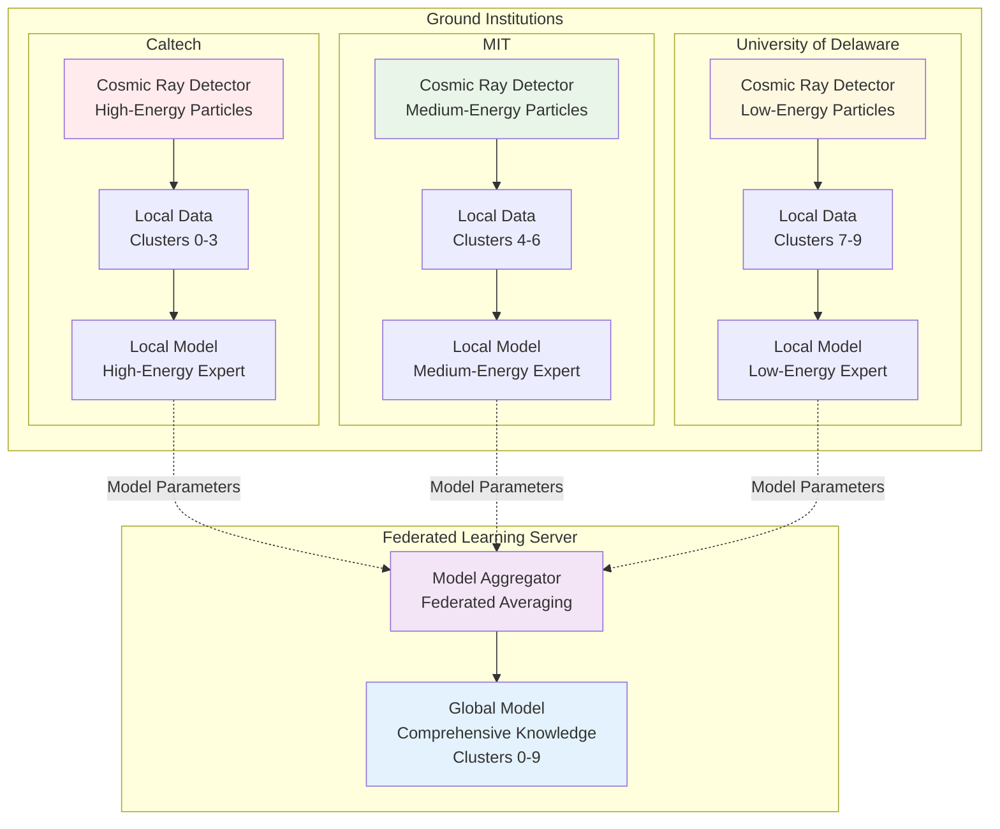
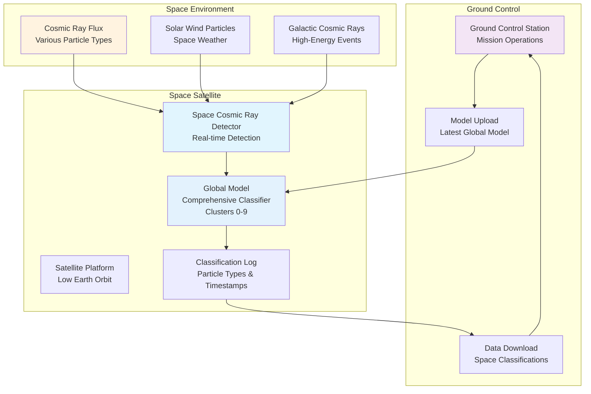
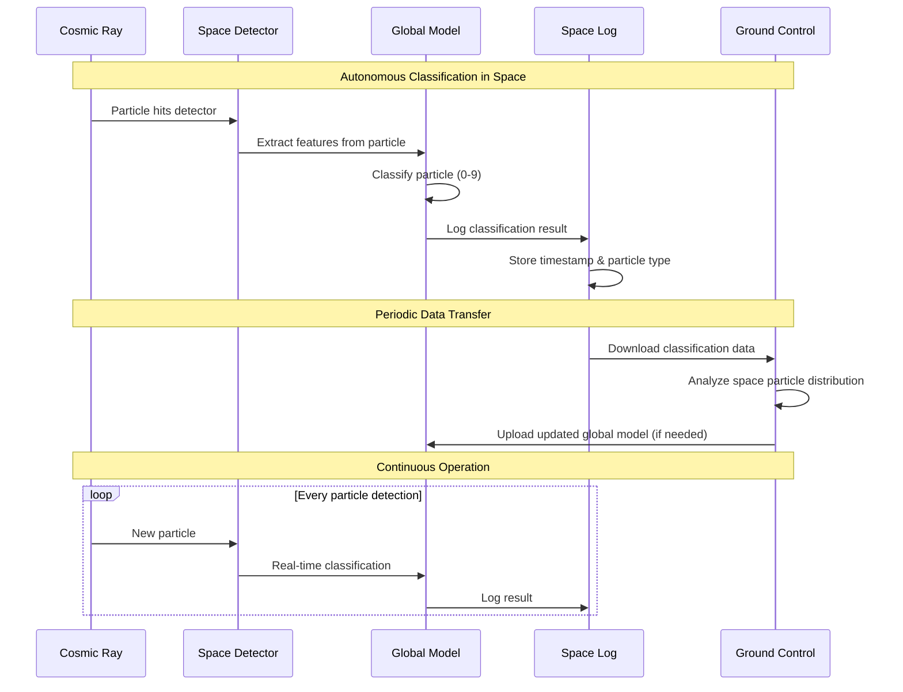

# Space-Based Global Model Experiment

## Experiment Overview

This experiment demonstrates how a federated learning global model can be deployed to space for autonomous cosmic ray classification.

## Ground-Based Federated Learning Phase



## Space Deployment Phase



## Real-Time Classification Flow



## Experiment Benefits

### **1. Autonomous Operation:**
- **No ground communication** needed for basic classification
- **Real-time decision making** in space
- **Independent operation** during communication blackouts

### **2. Comprehensive Knowledge:**
- **Global model** has expertise from all ground institutions
- **Can classify** any particle type (0-9)
- **Combines** high, medium, and low-energy expertise

### **3. Privacy Preservation:**
- **No raw data** shared between ground institutions
- **Only model parameters** exchanged
- **Collaborative learning** without data sharing

### **4. Space Science Applications:**
- **Real-time cosmic ray monitoring**
- **Space weather prediction**
- **Solar storm detection**
- **Galactic cosmic ray** composition analysis

## Technical Specifications

### **Satellite Requirements:**
```
Processing Power: 10-50 TOPS (AI inference)
Memory: 8-16 GB RAM
Storage: 1-5 TB SSD
Communication: S-band/X-band downlink
Power: Solar panels + batteries
Orbit: Low Earth Orbit (400-800 km)
```

### **Global Model Specifications:**
```
Model Size: 50-100 MB (compressed)
Inference Time: < 10ms per particle
Accuracy: > 90% on known particle types
Update Frequency: Monthly model updates
```

### **Ground Station Requirements:**
```
Data Rate: 1-10 Mbps downlink
Model Upload: 100-500 MB per update
Command & Control: Real-time telemetry
Analysis: Particle distribution statistics
```

## Expected Results

### **Classification Performance:**
- **Ground-trained model** performs well in space
- **Real-time classification** of cosmic ray particles
- **Comprehensive coverage** of particle types 0-9
- **Autonomous operation** without ground intervention

### **Scientific Value:**
- **Continuous monitoring** of cosmic ray flux
- **Space weather** correlation with particle types
- **Solar storm** detection and classification
- **Galactic cosmic ray** composition analysis

---

**Experiment Status**: Ready for SC25 demonstration  
**Next Steps**: Deploy global model to space-based detector  
**Expected Timeline**: 2025-2026 space mission 