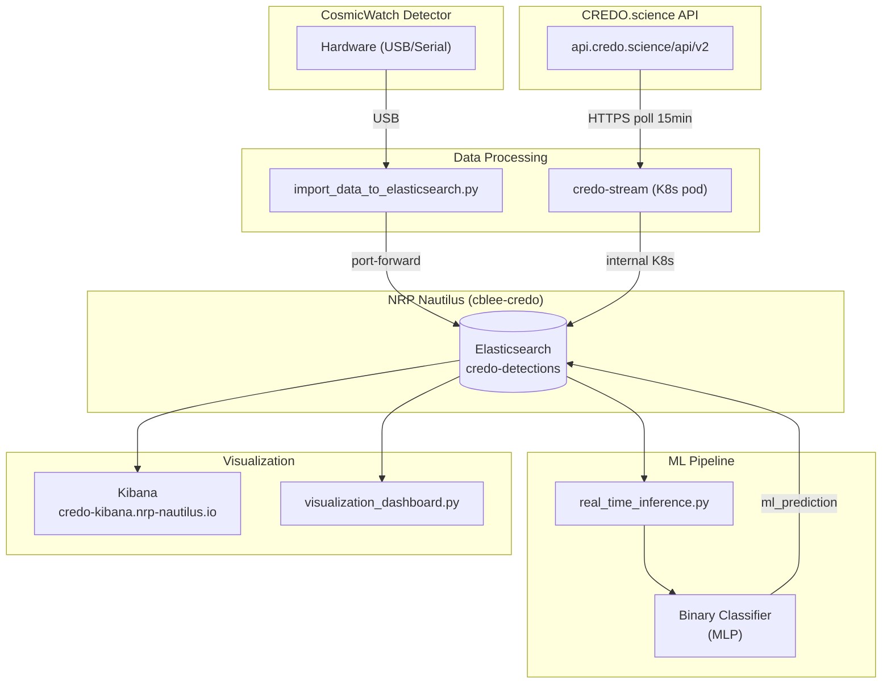
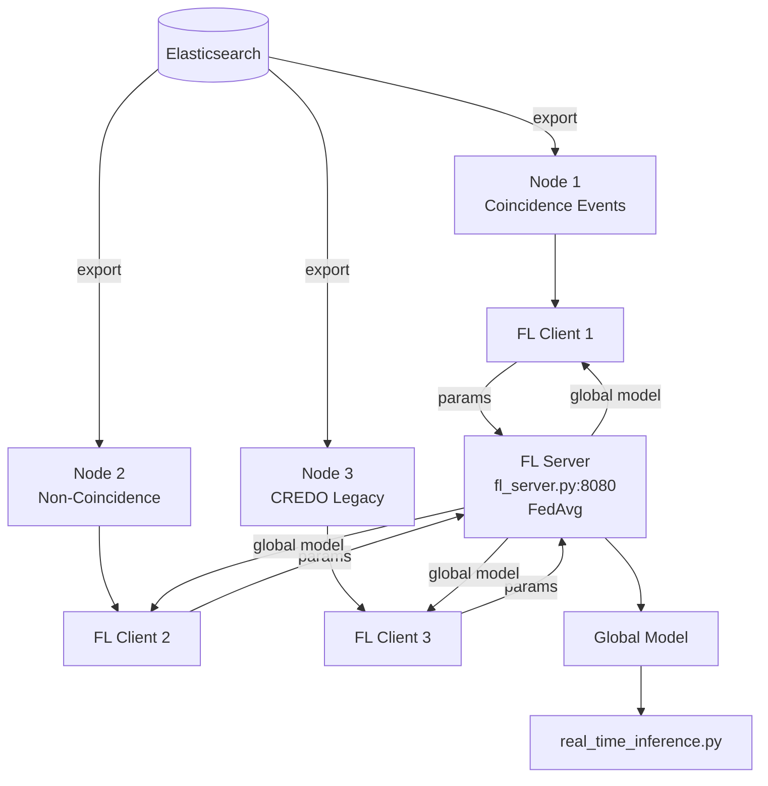

# Infrastructure & Operations

---

## NRP Nautilus Quick Reference

| Resource | Value |
|---|---|
| Kubernetes namespace | `cblee-credo` |
| Elasticsearch (internal) | `credo-elasticsearch-es-http:9200` |
| Elasticsearch (local) | `https://localhost:9200` (via port-forward) |
| Kibana (public) | https://credo-kibana.nrp-nautilus.io |
| ES username | `elastic` |
| ES password | `kubectl get secret credo-elasticsearch-es-elastic-user -n cblee-credo -o jsonpath='{.data.elastic}' \| base64 -d` |

```bash
# Port-forward Elasticsearch
kubectl port-forward -n cblee-credo svc/credo-elasticsearch-es-http 9200:9200

# Persistent (survives terminal close)
nohup kubectl port-forward -n cblee-credo svc/credo-elasticsearch-es-http 9200:9200 \
  > ~/.credo-port-forward.log 2>&1 &
```

---

## CosmicWatch Data Collection

```bash
# Quick start (uses helper scripts)
cd scripts
./start_port_forward.sh
./start_cosmicwatch_collection.sh   # prompts for port + detector ID

# Manual
export ES_HOST="https://localhost:9200"
export ES_USER="elastic"
export ES_PASS="<password>"
export ES_INDEX="credo-detections"
export ES_ENABLED="true"
cd CosmicWatch-Desktop-Muon-Detector-v3X/Data
python3 import_data_to_elasticsearch.py

# Verify data is flowing
curl -k -u "elastic:$ES_PASS" "https://localhost:9200/credo-detections/_count" \
  -H "Content-Type: application/json" \
  -d '{"query": {"term": {"source": "cosmicwatch-v3x"}}}'
```

**Port-forward stops when:** laptop sleeps or shuts down, network drops, or you kill it. For persistent collection use `screen` or `tmux`.

---

## CREDO.science Data Stream

### Export data locally
```bash
cd data-exporter
python3 credo-data-exporter.py \
  --username YOUR_USERNAME --password YOUR_PASSWORD \
  --endpoint https://api.credo.science/api/v2 \
  --data-type detection --dir ../credo-data-export
```

### Kubernetes deployment
```bash
export CREDO_USERNAME="carlynan"
export CREDO_PASSWORD="<password>"
./deploy/07-deploy-credo-stream.sh

# Check status
kubectl get pods -l app=credo-stream -n cblee-credo
kubectl logs -f deployment/credo-stream -n cblee-credo
```

### Known issues

**Rate limiting (429):** CREDO API rate-limits at <5 min polling. Stream is configured for 15 min intervals with 30 min backoff on 429. Fix: `kubectl set env deployment/credo-stream POLL_INTERVAL=900 -n cblee-credo && kubectl rollout restart deployment/credo-stream -n cblee-credo`

**S3 timeout:** Pod can reach CREDO API but times out connecting to `s3.cloud.cyfronet.pl` (export storage). Possible causes: NetworkPolicy blocking egress, firewall, or DNS. Diagnose:
```bash
kubectl run -it --rm debug --image=curlimages/curl --restart=Never -n cblee-credo \
  -- curl -v -I https://s3.cloud.cyfronet.pl
```
Fix options: add egress NetworkPolicy for port 443, configure HTTP proxy, or run streamer locally. If needed, contact NRP admins to allow egress to `s3.cloud.cyfronet.pl:443`.

**S3 returns 403 (NoSuchKey):** `credo-data-exporter.py` only handles 404 when polling for export readiness — 403 with `<Code>NoSuchKey</Code>` falls through and crashes. Fix in `data-exporter/credo-data-exporter.py`: handle both 404 and 403 status codes. See `docs/email_drafts.md` → Slawek bug report for the suggested fix.

---

## Kibana Dashboard

**Access:** https://credo-kibana.nrp-nautilus.io (login: `elastic` + password above)

**Create index pattern** (once): Stack Management → Index Patterns → `credo-detections*`, time field: `timestamp`

**Useful filters:**
- `source: cosmicwatch-v3x` — CosmicWatch events only
- `source.keyword: credo-science` — CREDO API events only
- `coincident: true` — coincidence events only
- `_exists_: ml_prediction` — events with ML predictions

**Recommended SC25 dashboard layout:**
1. Metrics row: total events, coincidence rate, predicted coincidence rate, model accuracy
2. Line chart: events over time (date histogram, 1h interval)
3. Line chart: actual coincidence rate vs ML predicted rate

**Model accuracy visualization** (Painless script aggregation):
```painless
if (doc['coincident'].value == doc['ml_prediction'].value) { return 1; } else { return 0; }
```

**Time range note:** data has 2025 timestamps — set default to "Last 7 days" or "Last 30 days" to include it.

---

## ML Inference & Dashboard Scripts

```bash
export ES_HOST="https://localhost:9200"
export ES_USER="elastic"
export ES_PASS="<password>"
export ES_INDEX="credo-detections"

# Add ml_prediction + ml_probability fields to new events (continuous)
python3 scripts/real_time_inference.py

# One-time run
python3 scripts/real_time_inference.py --once

# Python visualization dashboard (PNG output)
python3 scripts/visualization_dashboard.py --once

# Full demo orchestrator
python3 scripts/demo_script.py
```

Requires trained model at `scripts/models/binary_baseline_model.pth` and `binary_baseline_scaler.pkl` (created by `train_binary_baseline.py`).

---

## Architecture Diagrams

### System overview



### Federated learning architecture



### Network ports

| Connection | Protocol:Port |
|---|---|
| Public → Kibana ingress | HTTPS:443 |
| CREDO stream → CREDO API | HTTPS:443 |
| CREDO stream → Elasticsearch (internal) | HTTPS:9200 |
| Local port-forward → Elasticsearch | HTTPS:9200 |
| CosmicWatch → collection script | USB/Serial (115200 baud) |
| FL clients → FL server | HTTP:8080 |

---

## Troubleshooting

**Port-forward not working:**
```bash
ps aux | grep port-forward
tail -f ~/.credo-port-forward.log
./stop_port_forward.sh && ./start_port_forward.sh
```

**No data in Elasticsearch:**
```bash
# Verify ES is up
curl -k -u "elastic:$ES_PASS" "https://localhost:9200"

# Check index exists
curl -k -u "elastic:$ES_PASS" "https://localhost:9200/_cat/indices/credo-detections?v"

# Check pods
kubectl get pods -n cblee-credo
kubectl get svc -n cblee-credo | grep elasticsearch
```

**ml_prediction field missing in Kibana:** ensure `real_time_inference.py` is running and has processed recent documents.

**CREDO stream pod not starting:**
```bash
kubectl describe pod -l app=credo-stream -n cblee-credo
kubectl logs -l app=credo-stream -n cblee-credo
```
Check secrets exist: `kubectl get secret credo-credentials -n cblee-credo`
