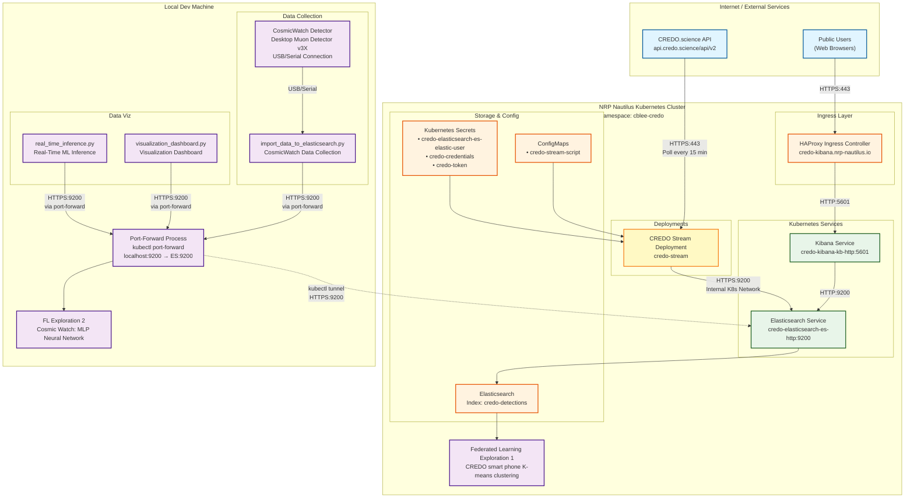
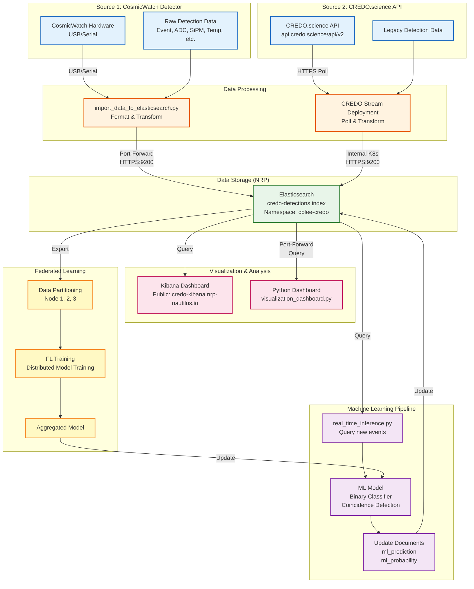
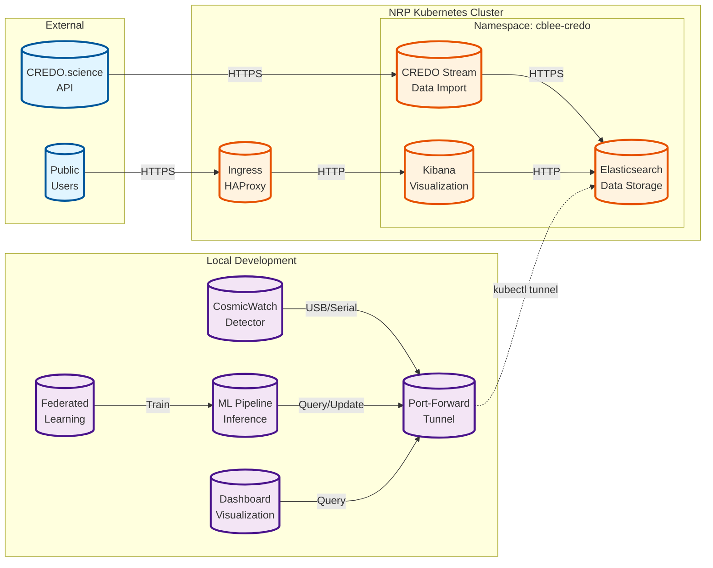
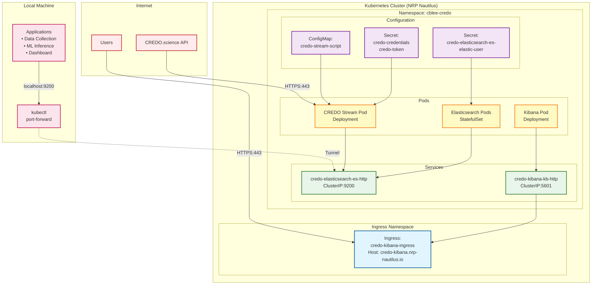
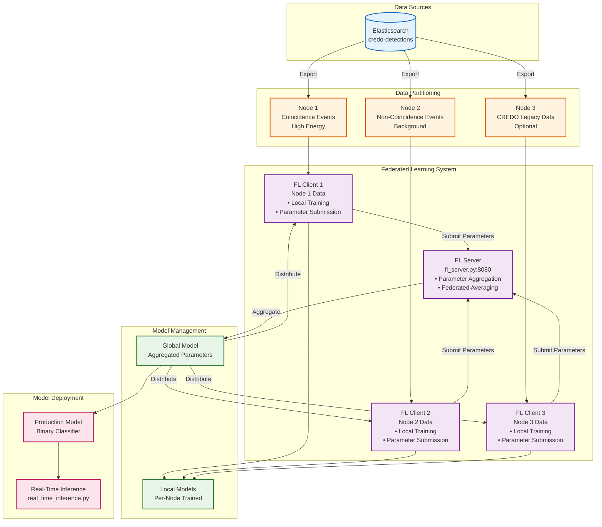
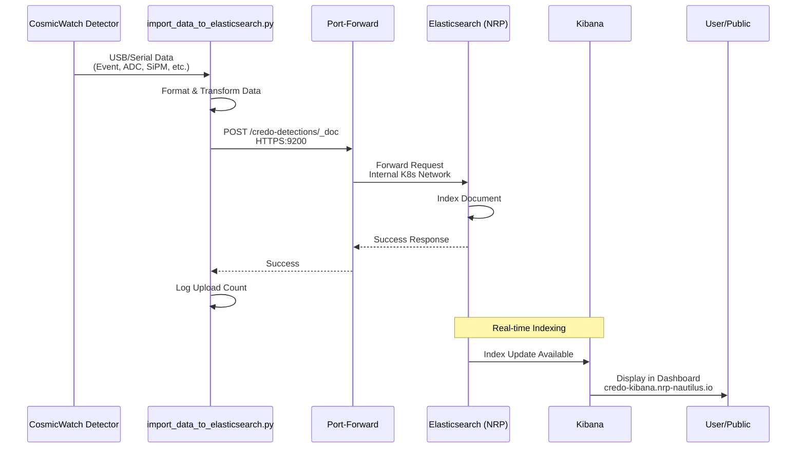
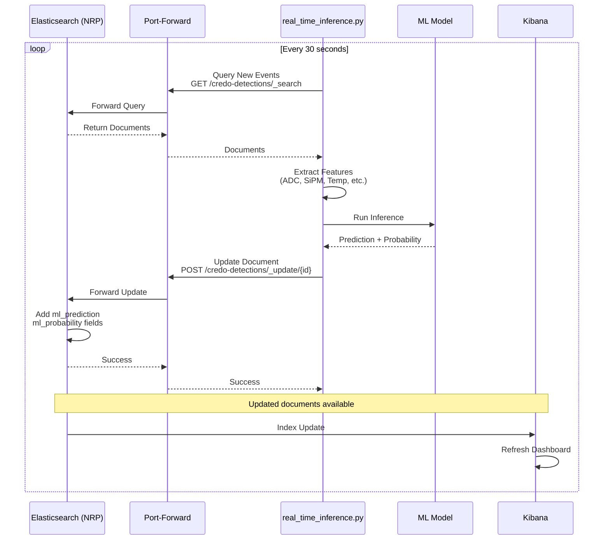
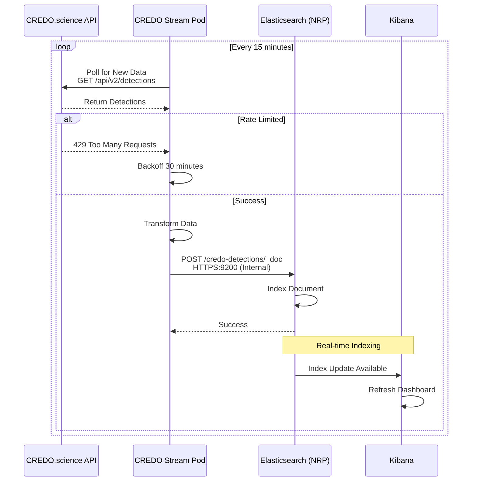

# NRP Network Map - Mermaid Diagrams

This document contains Mermaid diagrams visualizing the NRP network architecture for the CREDO API Tools project.

## Network Topology Diagram



## Data Flow Diagram



## Component Relationship Diagram



## Deployment Architecture Diagram



## Federated Learning Architecture



## Sequence Diagram: Data Collection Flow



## Sequence Diagram: ML Inference Flow



## Sequence Diagram: CREDO Stream Flow



## Network Ports and Protocols

```mermaid
graph LR
    subgraph External["External Access"]
        E1["HTTPS:443<br/>Public → Ingress"]
        E2["HTTPS:443<br/>Stream → CREDO API"]
    end
    
    subgraph NRP["NRP Internal"]
        N1["HTTP:5601<br/>Ingress → Kibana"]
        N2["HTTPS:9200<br/>Kibana → Elasticsearch"]
        N3["HTTPS:9200<br/>Stream → Elasticsearch"]
    end
    
    subgraph Local["Local Access"]
        L1["HTTPS:9200<br/>Port-Forward → ES"]
        L2["USB/Serial<br/>Detector → Script"]
        L3["HTTP:8080<br/>FL Clients → FL Server"]
    end
    
    External --> NRP
    NRP --> Local
    
    classDef external fill:#e1f5ff,stroke:#01579b,stroke-width:2px
    classDef nrp fill:#fff3e0,stroke:#e65100,stroke-width:2px
    classDef local fill:#f3e5f5,stroke:#4a148c,stroke-width:2px
    
    class E1,E2 external
    class N1,N2,N3 nrp
    class L1,L2,L3 local
```



## Legend

- **Blue nodes**: External/Internet services
- **Orange nodes**: NRP Kubernetes cluster components
- **Purple nodes**: Local development machine components
- **Green nodes**: Services and storage
- **Yellow nodes**: Deployments and pods
- **Pink nodes**: Visualization and ML components

## Usage

These Mermaid diagrams can be viewed in:
- GitHub (renders automatically in markdown)
- VS Code (with Mermaid extension)
- Online Mermaid editor: https://mermaid.live/
- Documentation tools that support Mermaid

To render locally, you can use:
```bash
# Install Mermaid CLI
npm install -g @mermaid-js/mermaid-cli

# Render to PNG
mmdc -i docs/NRP_NETWORK_MAP_MERMAID.md -o docs/nrp_network_map.png

# Or use online editor
# Copy diagram code to https://mermaid.live/
```

