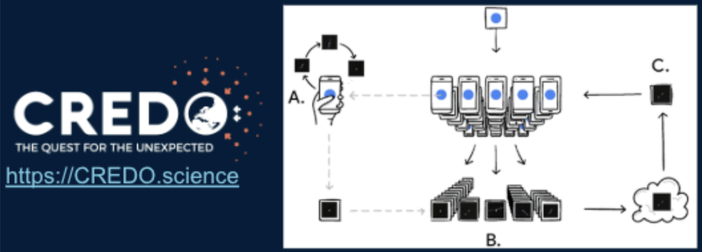
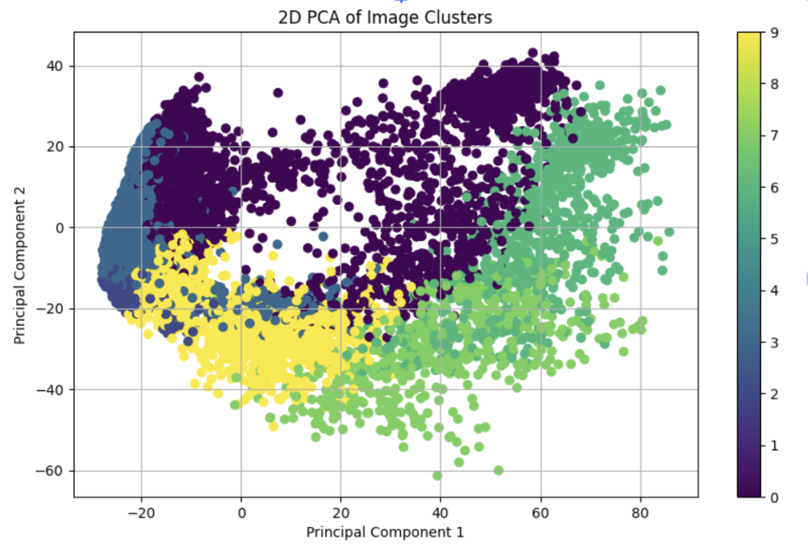
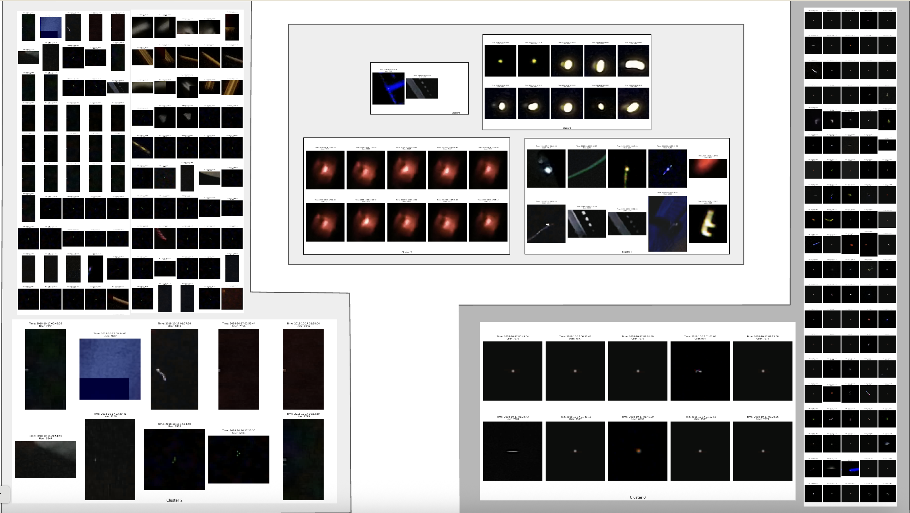
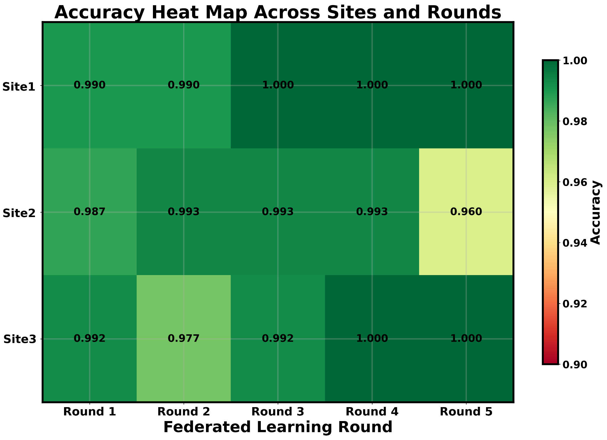
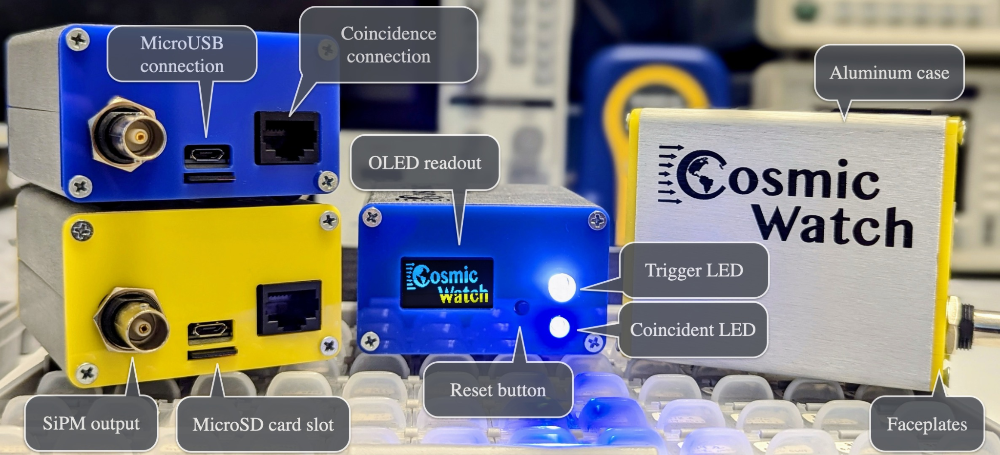
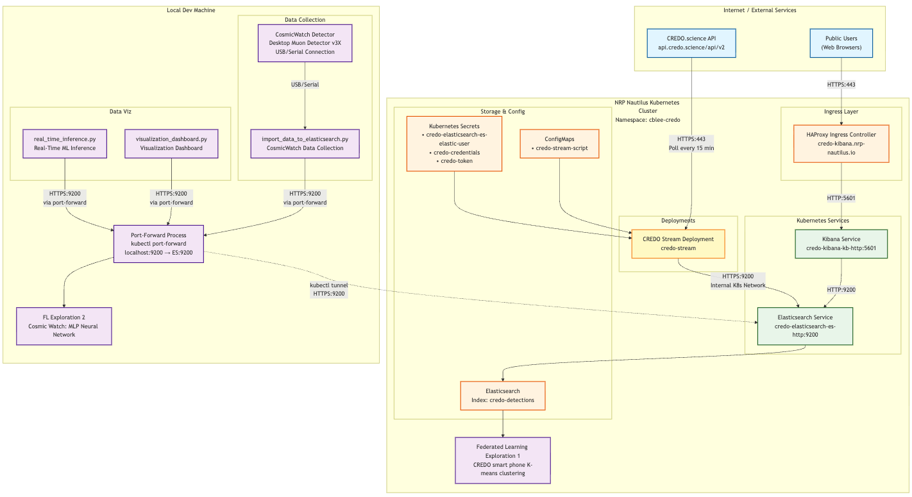
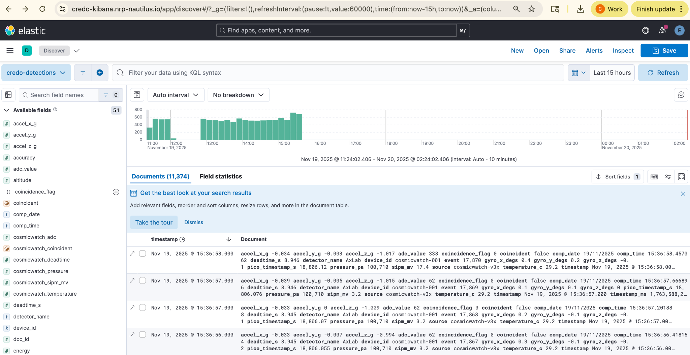
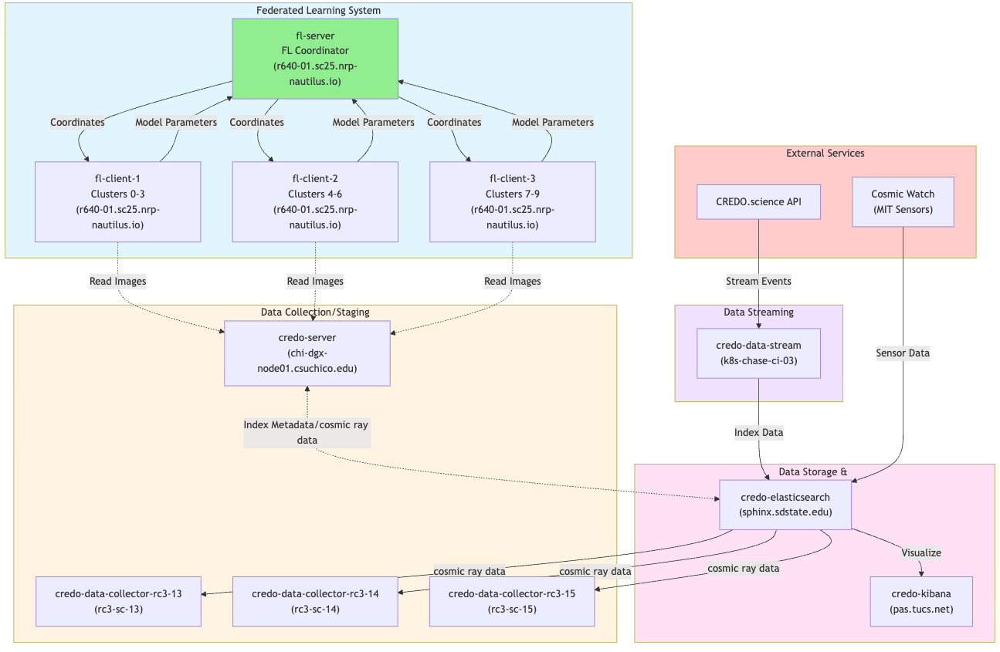
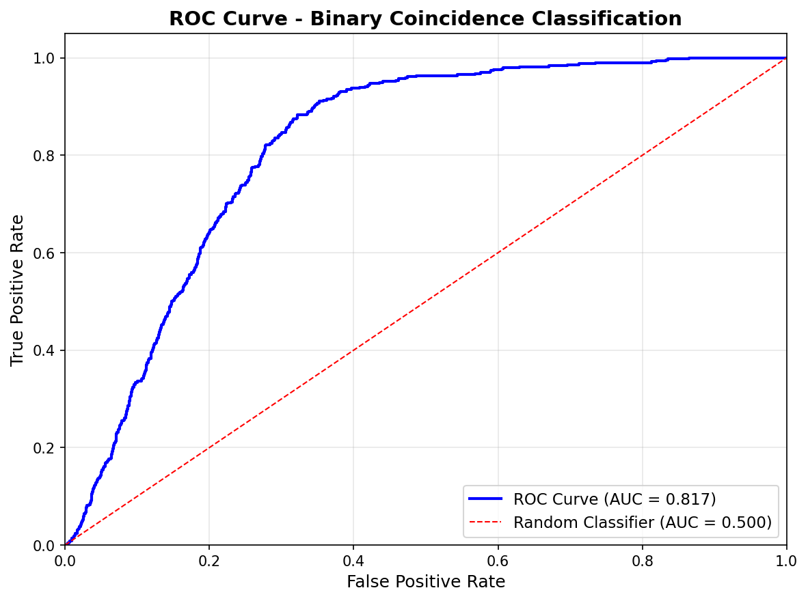
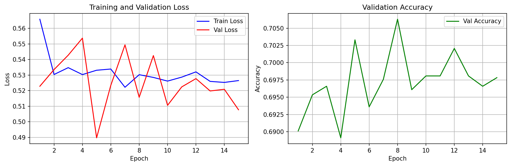

# Federated Learning for Cosmic Ray Event Classification: Real-Time Data Pipeline Demo at SC25

**Authors:** Carlyn Lee, Harvey Newman
**Institution:** California Institute of Technology, High Energy Physics
**Date:** November 2025

---

## Abstract

We present an early exploration of federated learning architectures for cosmic ray detection, using SCinet and National Research Platform nodes during SC25 to validate distributed training approaches and scope bandwidth requirements for multi-modal edge AI systems. Our work integrates CosmicWatch Desktop Muon Detector v3X hardware with a Kubernetes-based data pipeline on the NRP Nautilus infrastructure, enabling real-time data streaming, storage, and analysis. This work represents an initial validation of federated learning concepts for distributed cosmic ray science, with ongoing efforts to characterize bandwidth requirements for multi-modal data (images and sensor sequences) from edge devices including smartphone applications and low-power detectors (0.5W).

**Keywords:** Federated Learning, Cosmic Ray Detection, Real-Time Data Processing, Edge AI, Distributed Machine Learning, SCinet, National Research Platform

---

## 1. Introduction

### 1.1 Background

Cosmic ray detection and analysis is a critical area of particle physics research, with applications ranging from fundamental physics to space weather monitoring.  However, traditional centralized approaches to data analysis face challenges including data sovereignty concerns, bandwidth limitations, and the need for real-time processing at the edge. The CREDO (Cosmic-Ray Extremely Distributed Observatory) initiative aims to create a global network of cosmic ray detectors, enabling distributed data collection and collaborative scientific discovery. This global network is largely powered by citizen science using the CREDO smartphone application, which turns standard mobile devices into basic cosmic ray detectors. These distributed data sources collect detection events that are then aggregated and used in various machine learning and distributed computing demonstrations.

For SC'24, we conducted an initial exploration into automated cosmic ray event classification using K-means clustering on data sourced from the CREDO project. This dataset, collected between 2018 and 2019, comprised tens of thousands of detection events from over 50 unique smartphone devices. The clustering was performed solely on the image pixel data from the `frame_content` field—small 20×20 pixel regions extracted from smartphone camera frames—with no additional metadata or features used. By applying K-means clustering to features extracted from these images using a pre-trained ResNet50 model, we were able to identify 10 distinct clusters, some representing potential cosmic ray particle patterns (dot-like, 'worms' or lines, diffuse patterns) while others contained artifacts or noise. This work provided the motivation and initial strategy that laid the groundwork for the current project's shift to a more distributed approach using federated learning. However, as discussed in Section 4.1, the k-means clustering approach has fundamental scalability limitations that motivated our transition to transformer-based self-supervised learning methods.




Figure 1: The CREDO (Cosmic-Ray Extremely Distributed Observatory) smartphone application transforms standard mobile devices into “cosmic ray detectors” toward creating a global, citizen science-powered network for distributed data collection.




Figure 2: K-means clustering of CREDO smartphone data (2018-2019) on ResNet50 features, identifying 10 distinct clusters including both potential cosmic ray particle patterns and artifacts/noise. This work laid the foundation for the current federated learning exploration.




Figure 3: Initial clustering reveals distinct types of images from the `frame_content` field of CREDO data. Detections are categorized by visual forms like dot-like, 'worms' or lines, and diffuse patterns. The classifier also isolated clusters of artifacts or noise. Omitting noise can improve bandwidth efficiency for resource-constrained systems. The next challenge aims to extend the classification with federated learning.

### 1.2 Motivation

Prior to the SC25 demonstration, we conducted an initial federated learning experiment on the NRP Nautilus infrastructure. This experiment leveraged the k-means clustering results from CREDO images (described in Section 1.1) to partition data across three remote pods deployed on NRP Nautilus. The federated learning scripts were executed across these distributed nodes, enabling distributed model training. We validated the federated learning results, and saw successful model aggregation and convergence across the distributed nodes. This experiment validated the feasibility of federated learning for image classification in a distributed computing environment.

The SCinet Network Research Exhibition at SC25 provided additional infrastructure (SCinet network, Caltech booth nodes) that enabled quick deployment and demonstration of the system. The availability of these nodes allowed us to rapidly run experiments and showcase the federated learning architecture in a live exhibition setting. Our SC25 exploration focused on:

1. **Real-time Data Collection:** Real-time data collection from hardware detectors with sub-second indexing, leveraging the Kubernetes-based data pipeline on NRP Nautilus infrastructure
2. **Machine Learning and Federated Learning:** Machine learning-based classification for automatic event categorization, combined with federated learning for distributed model training without data sharing, exploring architectural concepts toward future space-based deployments that address on-board bandwidth limitations
3. **Distributed System Deployment:** Deployment of the exploration to a distributed computing environment using NRP Nautilus Kubernetes infrastructure, demonstrating the portability and scalability of the federated learning architecture across multiple nodes

However, this work represents early exploration, and we identified that the k-means clustering approach does not scale effectively (see Section 4.1).



**Figure 4:** Validation results from initial federated learning experiment on NRP Nautilus using three remote pods. The experiment uses k-means clustering results from CREDO images to partition data across distributed nodes, demonstrating model aggregation in a federated learning framework.


Another motivation was the CosmicWatch system. For this NRE we were able to integrate a CosmicWatch Desktop Muon Detector, a low-cost, low-power, open-source muon detector built and developed by Prof. Spencer Axani at the University of Delaware. The detectors use inexpensive plastic scintillators and silicon photomultipliers. It streams real-time high particle detections (potential cosmic ray events) directly to our Elasticsearch infrastructure. Each detection includes energy measurements, environmental sensors, and coincidence flags.

When a charged particle enters the scintillator, it produces photons that are converted into electrical signals by a silicon photomultiplier, and an Arduino Nano records the photon count and arrival time for each event.

A single unit detector is composed of two stacked scintillator devices. This arrangement is the key to detecting high-energy muons. When a particle passes through both stacked devices at essentially the same time, the electronics register a 'coincidence event.' This confirms that a high-energy particle, such as a muon, passed all the way through, helping us to filter out low-energy background noise that would only trigger one of the devices.



**Figure 5:** The CosmicWatch Desktop Muon Detector v3X components, showing the plastic scintillator, silicon photomultiplier, and Arduino Nano electronics. This low-cost, low-power (0.5W) detector enables real-time cosmic ray muon detection.

The system architecture integrates the CosmicWatch detector with our Kubernetes-based data pipeline on the NRP Nautilus infrastructure. Figure 6 illustrates the network topology, showing how data flows from the CosmicWatch detector through local port-forwarding tunnels to Elasticsearch storage in the NRP cluster. The architecture supports multiple data sources: real-time streaming from CosmicWatch detectors, periodic polling from the CREDO.science API via the CREDO Stream deployment, and federated learning clients that access partitioned data for distributed model training. Public access to the Kibana visualization dashboard is provided through an HAProxy Ingress Controller, while local development tools connect to Elasticsearch via secure port-forward tunnels. This distributed architecture enables real-time data collection, storage, and analysis while maintaining data sovereignty across participating nodes.



**Figure 6:** Network topology diagram showing the integration of CosmicWatch detectors, CREDO.science API, and federated learning clients with the NRP Nautilus Kubernetes infrastructure. The diagram illustrates data flow from local detectors through port-forwarding tunnels to Elasticsearch storage, with public access via Kibana dashboard and distributed model training across multiple nodes.



**Figure 7:** Kibana dashboard showing CREDO detections collected intermittently over several hours. The dashboard provides real-time visualization of cosmic ray detection events, including energy measurements, environmental sensor data, and machine learning predictions.

---

## 2. System Architecture

### 2.1 Overview

Our SC25 demonstration system consists of three main components:

1. **Data Collection & Storage Layer:** CREDO.science API data collection to  Elasticsearch on Kubernetes (NRP Nautilus). Kibana dashboards and monitoring tools.
2. **Federated Learning Layer:** r640-01 node for federated learning system using python Flower framework across three pods.
3. **Network Demonstration Layer:** RC3-SC nodes for SCinet bandwidth demonstration.

### 2.2 SC25 SCinet Demonstration Infrastructure

**Platform:** National Research Platform (NRP) Nautilus  
**Network:** SCinet infrastructure during SC25  
**Kubernetes Cluster:** NRP Nautilus  
**Namespace:** `cblee-credo`  

**Federated Learning System (r640-01 Node):**
- Four separate Kubernetes pods deployed on `r640-01.sc25.nrp-nautilus.io` for inter-pod communication
- **FL Server Pod:** 
  - Coordinates federated learning rounds using Flower framework
  - Implements Federated Averaging (FedAvg) for parameter aggregation
  - Manages training across three institutional clients
- **FL Client Pods:**
  - **Client 1 Pod:** Trains on clusters 0-3 (cosmic ray image patterns)
  - **Client 2 Pod:** Trains on clusters 4-6 (cosmic ray image patterns)
  - **Client 3 Pod:** Trains on clusters 7-9 (cosmic ray image patterns)
- **Model Architecture:** ResNet50-based convolutional neural network for 10-class image classification
- **Training Results:** Only one federated learning round completed, achieving approximately 95% classification accuracy across all three clients

**Data Collection System:**
- **RC3 Node Data Collector Pods:** Three dedicated pods for parallel data collection
  - `credo-data-collector-rc3-13` on `rc3-sc-13.sc25.nrp-nautilus.io`
  - `credo-data-collector-rc3-14` on `rc3-sc-14.sc25.nrp-nautilus.io`
  - `credo-data-collector-rc3-15` on `rc3-sc-15.sc25.nrp-nautilus.io`
- **CREDO Caltech Server:** Main data fetcher on `chi-dgx-node01.csuchico.edu`
- **Data Streaming Services:** Real-time data ingestion pods

**Storage and Visualization:**
- Elasticsearch service (port 9200) on `sphinx.sdstate.edu`
- Kibana service (port 5601) on `pas.tucs.net.internet2.edu`
- Public ingress for Kibana dashboard access

**Network Architecture:**
- Federated learning system (4 separate pods: 1 server pod + 3 client pods) co-located on r640-01 node for parameter exchange
- RC3 node pods distributed across dedicated Caltech booth nodes (rc3-sc-13, rc3-sc-14, rc3-sc-15) for network bandwidth demonstration
- SCinet network connectivity for data transfer and network testing
- Public access to Kibana via HAProxy Ingress Controller



**Figure 8:** System architecture diagram showing the SC25 demonstration deployment across NRP nodes. The federated learning system (four pods on r640-01) exchanges compact model parameters rather than raw data, approximately 98.8% bandwidth reduction compared to centralized approaches. Data collection pods on RC3 nodes (rc3-sc-13, rc3-sc-14, rc3-sc-15) demonstrate SC25 network bandwidth through parallel data fetching and inter-pod transfers. All data flows through Elasticsearch for storage and indexing, with visualization via Kibana dashboards.

### 2.3 SC25 Demonstration Data Flow

The SC25 demonstration included two federated learning explorations:

**Demo 1: CREDO Image Classification Federated Learning**
```
CREDO.science API
    ↓
Data Collectors (RC3 Nodes + Caltech Server)
    ↓
Elasticsearch (NRP Kubernetes)
    ↓
    ├─→ Kibana Dashboard (Public Access)
    └─→ Federated Learning System (r640-01 Node)
        ├─→ FL Server (Coordinates Training)
        ├─→ Client 1 Pod (Clusters 0-3)
        ├─→ Client 2 Pod (Clusters 4-6)
        └─→ Client 3 Pod (Clusters 7-9)
```

**Demo 2: CosmicWatch Binary Classification Federated Learning**
```
CosmicWatch Detector (USB/Serial)
    ↓
import_data_to_elasticsearch.py (Local)
    ↓
Port-Forward Tunnel
    ↓
Elasticsearch (NRP Kubernetes)
    ↓
    ├─→ Kibana Dashboard (Public Access)
    ├─→ Real-Time Inference Pipeline
    └─→ Federated Learning System (Local)
        ├─→ FL Server (HTTP-based, port 8080)
        ├─→ Client 1 (Coincidence Events)
        ├─→ Client 2 (Non-Coincidence Events)
        └─→ Client 3 (CREDO Legacy Data, optional)
```

### 2.4 Data Sources

1. **CosmicWatch Desktop Muon Detector v3X**
   - Real-time detection events via USB/Serial connection
   - Fields: Event number, ADC values, SiPM voltage, coincidence flags, environmental sensors
   - Collection rate: Continuous, sub-second indexing

2. **CREDO.science API**
   - Historical and real-time data via REST API
   - Polling interval: 15 minutes
   - Legacy data from 2017-2018

---

## 3. Data Collection and Analysis

### 3.1 CosmicWatch Dataset Characteristics

**Total Events:** 40,207  
**Collection Period:** ~2 days of intermittent operation  
**Data Sources:**
- CosmicWatch v3X: Real-time streaming

**Event Distribution:**
- **Coincidence events:** 4,947 (12.3%)
- **Non-coincidence events:** 35,260 (87.7%)
- **Class imbalance ratio:** 1:7

### 3.2 Feature Analysis (CosmicWatch Dataset)

**Primary Features:**
- **ADC Value:** 67-4053 (mean: 267.26, std: 208.98)
  - Coincidence events: mean=394.47, median=338.00
  - Non-coincidence events: mean=249.42, median=181.00
- **SiPM Voltage:** 3.4-1000 mV (mean: 13.84 mV, std: 14.46 mV)

**Environmental Features:**
- Temperature: 23.7-28.7°C
- Pressure: 98,417-101,907 Pa
- Accelerometer: X, Y, Z (g)
- Gyroscope: X, Y, Z (deg/sec)

### 3.3 Preliminary Physics Observations (CosmicWatch Dataset)

**Coincidence Detection:**
- Coincidence events represent muons passing through both stacked detectors
- Higher ADC values (394.47 vs 249.42) suggest higher energy particles
- Observed coincidence rate (12.3%) appears consistent with theoretical expectations (further validation needed)

**Energy Spectrum:**
- ADC distribution reveals energy spectrum of detected particles
- Coincidence events cluster at higher ADC values (>300)
- Distribution appears consistent with expected muon energy spectrum (further analysis needed)


**Figure XX:** Energy spectrum visualization showing ADC distribution of detected particles, with coincidence events clustering at higher ADC values.


**Figure XX:** Environmental correlations between detector measurements and environmental conditions (temperature, pressure, etc.).


**Figure XX:** Temporal patterns in detection events over the collection period.

---

## 4. Machine Learning Models

The SC25 demonstration included two machine learning models for different classification tasks. This section describes the initial approaches used for validation, followed by a discussion of scalability limitations and our transition to transformer-based self-supervised learning methods.

### 4.1 CREDO Image Classification Model (Demo 1)

**Task:** 10-class image classification of cosmic ray patterns  
**Model Type:** ResNet50-based Convolutional Neural Network  
**Framework:** TensorFlow/Keras with Flower framework for federated learning

**Architecture:**
```
Input Layer (224×224×3 images)
    ↓
ResNet50 Base (ImageNet pre-trained, frozen)
    ↓
Global Average Pooling
    ↓
Dense Layer (512 neurons, ReLU)
    ↓
Dropout (0.5)
    ↓
Output Layer (10 neurons, Softmax)
```

**Hyperparameters:**
- Optimizer: Adam (learning rate: 0.001)
- Loss function: Categorical cross-entropy
- Batch size: 32
- Epochs: 3 per federated learning round
- Image size: 224×224×3

**SC25 Results:**
- One federated learning round completed successfully
- Accuracy: ~95% across all three clients
- Model trained on partitioned data: Client 1 (clusters 0-3), Client 2 (clusters 4-6), Client 3 (clusters 7-9)

**K-Means Clustering Scalability and Limitations:**

While the k-means clustering approach successfully validated the federated learning architecture, it has fundamental limitations that prevent it from scaling effectively. First, k-means requires pre-specifying the number of clusters (k=10 in our case), which assumes a priori knowledge of the number of distinct cosmic ray particle types. However, the true number of particle types is unknown and may vary with detector characteristics, new particle types cannot be discovered without re-clustering the entire dataset, and the approach cannot adapt to evolving data distributions.

Second, the ResNet50 feature extraction followed by k-means operates in a fixed feature space optimized for natural images, not cosmic ray physics. The clustering was performed only on image pixel data from the `frame_content` field (20×20 pixel regions), with no additional metadata, timestamps, location information, or sensor data used. This means the features may not capture physics-relevant patterns such as energy spectra, track morphology, or temporal correlations. There is no mechanism to learn domain-specific representations, and the approach has limited ability to incorporate multi-modal information (images + sensor data).

Third, k-means produces hard cluster assignments without uncertainty quantification. It cannot handle ambiguous or borderline cases, provides no probabilistic interpretation of cluster membership, and is difficult to incorporate into downstream physics analysis.

Finally, when applied to federated learning, k-means clustering introduces additional complications. Cluster centers must be synchronized across nodes, requiring full feature space communication. Non-IID data distributions across nodes can lead to inconsistent cluster definitions, and the approach does not leverage the benefits of distributed representation learning.

These limitations motivated our transition to transformer-based self-supervised learning approaches, as discussed in Section 4.3.

### 4.2 CosmicWatch Binary Classification Model (Demo 2)

**Task:** Binary classification of cosmic ray events  
**Classes:**
- **Class 1 (Coincidence):** Muon passing through both detectors (Flag=1)
- **Class 0 (Non-Coincidence):** Single detector hit (Flag=0)

**Rationale:**
- Coincidence events are hypothesized to represent higher-energy muons
- Clear separation in ADC distributions (394.47 vs 249.42) observed
- Classification approach based on detector design (physics validation pending)

**Model Type:** Multi-Layer Perceptron (MLP)

**Architecture:**
```
Input Layer (5-7 features)
    ↓
Hidden Layer 1 (64 neurons, ReLU)
    ↓
Dropout (0.3)
    ↓
Hidden Layer 2 (32 neurons, ReLU)
    ↓
Dropout (0.3)
    ↓
Output Layer (1 neuron, Sigmoid)
```

**Features Used:**
- ADC value (normalized)
- SiPM voltage (normalized)
- Temperature (normalized)
- Pressure (normalized)
- Deadtime (normalized)

**Hyperparameters:**
- Optimizer: Adam (learning rate: 0.001)
- Loss function: Binary cross-entropy with class weights
- Batch size: 32
- Epochs: 50-100 (with early stopping)
- Class weights: {0: 1.0, 1: 7.0} (inverse frequency)

**Training Strategy:**
- Data Split: Training (80%), Validation (10%), Test (10%)  
- Class Imbalance: Weighted sampling, class weights {0: 1.0, 1: 7.0}  
- Early Stopping: Monitor validation loss, patience: 10 epochs

**Performance Metrics:**
- **Accuracy:** 69.78%, **ROC-AUC:** 0.82
- **Optimal Threshold:** 0.72 produces predicted rate (13.35%) close to observed (12.29%)
- **Baseline (threshold=0.5):** Precision: 0.27, Recall: 0.88
- **Optimal (threshold=0.72):** Precision: 0.31, Recall: 0.34, F1-Score: 0.32

**Analysis:**
- ROC-AUC of 0.82 indicates good class separation capability
- High recall (0.88 at baseline) means model catches most coincidence events
- Optimal threshold produces predicted rate close to observed rate (physics validation pending)
- Precision can be improved with more training or feature engineering



**Figure XX:** Receiver Operating Characteristic (ROC) curve for the CosmicWatch binary classification model, showing ROC-AUC of 0.82. The curve demonstrates class separation capability, with the model able to distinguish between coincidence and non-coincidence events.



**Figure XX:** Training and validation loss curves for the CosmicWatch binary classification model, showing model convergence. The model achieved stopping at epoch 15, indicating convergence with the current architecture and hyperparameters.

### 4.3 Transition to Transformer-Based Self-Supervised Learning

We are transitioning from k-means clustering to transformer-based self-supervised learning approaches that are more suitable for our multi-modal cosmic ray detection data. This transition follows recommendations from RINO researchers (Renormalization Group Invariance with No Labels [1]).

The k-means clustering limitations identified in Section 4.1, combined with the handling of multi-modal data (CREDO smartphone images and CosmicWatch sensor sequences), motivated exploration of transformer-based architectures. These approaches proposes to learn adaptive representations without fixed cluster assumptions, handle multi-modal data in a unified framework, scale to large distributed datasets, and incorporate physics-relevant patterns through self-supervised pre-training.

Following recommendations from RINO researchers, we are exploring DINO (Distillation with No Labels) and DINO-v2/v3 architectures for CREDO smartphone image data. Since CREDO images are already in standard image format, vision transformers are directly applicable. We are using META's pre-trained DINO-v2/v3 models (facebook/dinov2-base, dinov2-large, dinov2-giant), which leverage pre-trained models trained on large natural image datasets. These models can learn general visual features (edges, textures, patterns) that transfer to cosmic ray images, and fine-tuning adapts these general features to cosmic ray-specific patterns. An initial implementation is complete, and we are currently validating functionality. This approach has the advantage of not requiring adaptation of particle physics frameworks designed for momentum space.

For CosmicWatch detector data, we are exploring BERT/GPT-style transformer models. Since timestamps are essential and the data consists of irregularly sampled event sequences, we "tokenize" each event as a token and learn contextual embeddings based on preceding and succeeding events. This approach seems appropriate for sequential event data with temporal dependencies, can learn contextual relationships between events, and handles irregular sampling naturally through sequence modeling. An initial implementation is currently being tested for masked event modeling pre-training.

We are also exploring multi-modal fusion architectures that combine both data types. The architecture consists of an image encoder (DINO) and an event encoder (BERT) feeding into a fusion layer that produces a unified embedding space. Our implementation attempts to achieve a high-confidence event identification requiring agreement across both modalities, cross-modal validation using image features to validate event sequences, and unified representation enabling joint reasoning.

Current implementation status includes DINO for CREDO images and BERT/GPT for CosmicWatch sequences, both of which are currently being validated for functionality. The multi-modal fusion architecture is also implemented and under exploration. Qualcomm QAIC deployment is pending, waiting on new fiber for the 400Gbps NIC.

---

## 5. Federated Learning Implementation

### 5.1 Motivation

Federated learning enables distributed model training across multiple institutions without sharing raw data, addressing:

- **Bandwidth efficiency:** Only model parameters are shared, not raw data
- **Privacy:** Sensitive data never leaves local nodes
- **Scalability:** Distributed training across global detector network

### 5.2 Architecture

**Standalone HTTP-Based Implementation:**
- No framework dependencies (avoided Flower/protobuf conflicts)
- Standard Python libraries only (HTTP server, requests)
- Functional implementation with error handling

**Components:**
1. **FL Server** (`fl_server.py`)
   - HTTP server on port 8080
   - Coordinates federated learning rounds
   - Implements Federated Averaging (FedAvg)
   - Aggregates model parameters from clients
   - Distributes global model

2. **FL Client** (`fl_client.py`)
   - HTTP client for each data node
   - Loads local data partitions (CSV files exported from Elasticsearch)
   - Trains models locally (not deployed as NRP pods)
   - Sends parameters to server and receives global model updates

3. **Experiment Orchestrator** (`run_fl_experiment.py`)
   - Automatic server and client management
   - Complete experiment lifecycle
   - Result collection and reporting

### 5.3 Data Partitioning Strategy

Unlike the CREDO smartphone app FL demonstration which used multiple NRP pods as data sources, CosmicWatch FL used local data partitions from a single detector system. Data was exported from Elasticsearch and partitioned by event characteristics into CSV files, with FL clients running locally.

**Node 1:** Coincidence Events (4,947 samples, 80% training)  
**Node 2:** Non-Coincidence Events (35,260 samples, 80% training)  
**Node 3:** CREDO.science Legacy Data (optional, historical 2017-2018)

### 5.4 Federated Learning Process

**Round Execution:**
1. Server initializes global model
2. Server distributes global model to all clients
3. Each client trains locally on its data partition
4. Clients send updated parameters to server
5. Server aggregates parameters using Federated Averaging (FedAvg)
6. Server updates global model
7. Process repeats for N rounds

**Federated Averaging:**
- Weighted parameter aggregation based on sample counts
- Formula: `θ_global = Σ(n_i * θ_i) / Σ(n_i)`
- Preserves data distribution characteristics


---

## 6. Real-Time Inference and Visualization

### 6.1 Components

**Inference Pipeline:**
- Queries Elasticsearch for new documents (5-minute window, 30-second polling)
- Runs inference using trained baseline model (threshold: 0.72)
- Updates documents with `ml_prediction` and `ml_probability` fields

**Visualization:**
- Python dashboard: Real-time statistics, event counts, model accuracy tracking
- Kibana dashboard: https://credo-kibana.nrp-nautilus.io
  - Real-time data visualization, geo-visualization, ML predictions overlay
- Grafana monitoring: https://grafana.nrp-nautilus.io
  - Kubernetes pod compute resources monitoring (CPU, memory usage)
  - Network transmission metrics across NRP nodes during SC25

---

## 7. Network Resource Usage and Bandwidth Requirements Scoping

### 7.1 SCinet and NRP Infrastructure Utilization

**Network Infrastructure:**
- **SCinet:** High-speed network connectivity during SC25 exhibition
- **NRP Nautilus:** Kubernetes cluster hosting Elasticsearch, Kibana, and CREDO Stream services
- **Platform:** National Research Platform nodes for distributed computing

**Data Transmission Patterns:**
- Real-time data streaming from CosmicWatch detectors via port-forwarding to NRP Elasticsearch
- CREDO.science API polling (15-minute intervals) from NRP pods to external API
- Federated learning parameter exchange (model updates ~100KB per round vs GB of raw data)
- Public access to Kibana dashboard via HAProxy Ingress Controller

### 7.2 Bandwidth Requirements Scoping for Multi-Modal Edge AI

A key focus of this work is scoping bandwidth requirements for science use-cases involving multi-modal data from edge devices. Our system includes two primary data sources with distinct characteristics. CREDO smartphone images consist of 20×20 pixel regions (PNG, RGBA format) extracted from 960×720 frames, with variable collection rates depending on smartphone app usage. We have approximately 369,804 documents in Elasticsearch with the `frame_content` field. Bandwidth considerations for these images include compression strategies and selective transmission of high-confidence events. CosmicWatch sensor sequences contain ADC values, SiPM voltage, temperature, pressure, accelerometer, and gyroscope readings, with continuous collection at sub-second indexing rates. We collected 40,207 events over approximately 2 days. The sequential nature of this event data and temporal correlations guide compression strategies.

We are evaluating several bandwidth efficiency strategies. Federated learning parameter exchange transmits model updates of approximately 100KB per round compared to gigabytes of raw data, achieving approximately 98.8% bandwidth reduction compared to centralized approaches. This is critical for space-based deployments with limited on-board bandwidth. Selective data transmission filters noise and artifacts identified by clustering (k-means) or classification models, transmitting only high-confidence events or model updates to reduce bandwidth requirements for resource-constrained systems. Multi-modal compression leverages cross-modal validation to reduce false positives, transmitting only events with high cross-modal agreement. The unified embedding space enables efficient representation of multi-modal data.

Ongoing work includes characterizing bandwidth requirements for transformer-based models (DINO, BERT) in federated learning settings, evaluating compression strategies for multi-modal data, scoping requirements for Qualcomm QAIC deployment (400Gbps NIC pending), and exploring edge AI inference to reduce upstream bandwidth needs.

---

## 8. Toward Space-Ready Architecture

This work explores architectural concepts toward space deployment, addressing constraints including low power consumption (0.5W detector), bandwidth efficiency (federated learning shares ~100KB model updates vs GB of raw data), edge AI processing capability (<10ms inference), and autonomous operation. However, significant additional development is needed before this system is truly space-ready, including more sophisticated analysis techniques and logic.

---

## 9. Conclusion

We conducted an early exploration of federated learning architectures for cosmic ray detection using SCinet and National Research Platform infrastructure during SC25. This work validated a simple k-means clustering approach with federated learning, successfully demonstrating proof-of-concept distributed training across multiple NRP nodes. However, we identified fundamental scalability limitations of the k-means approach, including fixed cluster assumptions, feature space limitations, and challenges in multi-modal settings.

This exploration motivated our transition to transformer-based self-supervised learning approaches, following recommendations from the RINO team. We are currently exploring DINO architectures for CREDO images, BERT/GPT models for CosmicWatch event sequences, and multi-modal fusion combining both modalities. These approaches address the scalability limitations of k-means while enabling adaptive representation learning and multi-modal data integration.

A key focus of this work is scoping bandwidth requirements for multi-modal edge AI systems, critical for future space-based deployments. We characterized data transmission patterns and evaluated bandwidth efficiency strategies, including federated learning parameter exchange (~100KB per round vs GB of raw data) and selective data transmission based on model confidence.

This work represents initial validation and exploration rather than a complete system. Significant additional development planned, including validation of transformer-based approaches, comprehensive bandwidth characterization, and alignment of model predictions with theoretical physics expectations. The SC25 demonstration provided valuable infrastructure for rapid validation and data exploration, enabling iterative development toward more scalable architectures.

---

## Acknowledgments

We thank:
- SCinet and NRP Nautilus team for network infrastructure support
- CREDO.science for API access and data
- CosmicWatch team for detector hardware and software
- SC25 Network Research Exhibition organizers

---

## References

1. Zichun et al. "Renormalization Group Invariance with No Labels." arXiv:2509.07486, 2025.
2. CREDO (Cosmic-Ray Extremely Distributed Observatory). https://credo.science
3. CosmicWatch Desktop Muon Detector. https://github.com/spenceraxani/CosmicWatch-Desktop-Muon-Detector
4. McMahan, B., et al. "Communication-Efficient Learning of Deep Networks from Decentralized Data." AISTATS, 2017.
5. NRP Nautilus. https://nautilus-optiputer.net
6. Elasticsearch. https://www.elastic.co/elasticsearch
7. Kibana. https://www.elastic.co/kibana
8. Kubernetes. https://kubernetes.io
9. DINO-v2. https://dinov2.metademolab.com/
10. DINO-v3. https://ai.meta.com/dinov3/

---

## Appendix A: System Configuration

### A.1 Kubernetes Deployment

**Namespace:** `cblee-credo`

**Services:**
- Elasticsearch: `credo-elasticsearch-service` (port 9200)
- Kibana: `credo-kibana-kb-http` (port 5601)

**Deployments:**
- CREDO Stream: `credo-stream` (data import from API)

**Ingress:**
- Kibana: `credo-kibana.nrp-nautilus.io`

### A.2 Model Configuration

**Model Files:**
- Model: `scripts/models/binary_baseline_model.pth`
- Scaler: `scripts/models/binary_baseline_scaler.pkl`

**Hyperparameters:**
- Architecture: 64 → 32 neurons
- Dropout: 0.3
- Learning rate: 0.001
- Batch size: 32
- Optimal threshold: 0.72

### A.3 Data Partitions

**Node 1:** `data/data_partitions/node1_coincidence_events.csv` (4,947 samples)  
**Node 2:** `data/data_partitions/node2_non_coincidence_events.csv` (35,260 samples)  
**Node 3:** `data/data_partitions/node3_credo_data.csv` (optional)

---

## Appendix B: Code Availability

**Repository:** https://github.com/carlynlee/credo-api-tools

**Key Scripts:**
- `scripts/train_binary_baseline.py` - Model training
- `scripts/fl_server.py` - Federated learning server
- `scripts/fl_client.py` - Federated learning client
- `scripts/run_fl_experiment.py` - FL experiment orchestrator
- `scripts/real_time_inference.py` - Real-time inference pipeline
- `scripts/visualization_dashboard.py` - Visualization dashboard

**Documentation:**
- Complete setup and deployment guides
- API documentation
- Troubleshooting guides
- SC25 demonstration plan


